.. role:: vscode
.. role:: intellij
.. role:: visualstudio
.. role:: heading

.. meta::
    :description: A quick guide for creating Gauge test projects on Windows, macOS, Ubuntu/Linux using Visual Studio Code, IntelliJ IDEA and Visual Studio for the languages Java, JavaScript, Python, Ruby, C#
    :keywords: create testing project vscode idea visualstudio automation

.. cssclass:: topic

:heading:`Create a Testing project using Gauge`
===============================================

.. include:: ../change_filter.rst

.. role:: highlighted-syntax

.. cssclass:: csharp dynamic-content

      .. admonition:: System Requirements

            * Dotnet Core Sdk >= 2.0

.. cssclass:: java dynamic-content

      .. admonition:: System Requirements

            * JDK >= 11

.. cssclass:: javascript dynamic-content

      .. admonition:: System Requirements

            * Nodejs >= 10.16.3 (LTS)

.. cssclass:: python dynamic-content

      .. admonition:: System Requirements

            * Python >= 2.7

            * Pip

.. cssclass:: ruby dynamic-content

      .. admonition:: System Requirements

            * Ruby >= 2.3.0

            * Bundler

.. cssclass:: vscode dynamic-content

:vscode:`Creating a Testing Project in VS Code`
-----------------------------------------------

Gauge projects can be created and executed in Visual Studio Code using the Gauge extension for Visual Studio Code.

.. cssclass:: csharp dynamic-content

      In this guide, you'll be able to learn how to add a sample C# testing project in Visual Studio Code

.. cssclass:: java dynamic-content

      In this guide, you'll be able to learn how to add a sample Java testing project in Visual Studio Code

.. cssclass:: javascript dynamic-content

      In this guide, you'll be able to learn how to add a sample Javascript testing project in Visual Studio Code

.. cssclass:: python dynamic-content

      In this guide, you'll be able to learn how to add a sample Python testing project in Visual Studio Code

.. cssclass:: ruby dynamic-content

      In this guide, you'll be able to learn how to add a sample Ruby testing project in Visual Studio Code

Step 1
~~~~~~

.. cssclass:: macos dynamic-content

      Once the extension is installed, press Cmd + shift + p to display the editor's command palette, and then execute the following command to create a new testing project in Gauge:

.. cssclass:: windows dynamic-content

      Once the extension is installed, press ctrl + shift + p to display the editor's command palette, and then execute the following command to create a new testing project in Gauge:

.. cssclass:: linux dynamic-content

      Once the extension is installed, press ctrl + shift + p to display the editor's command palette, and then execute the following command to create a new testing project in Gauge:

:highlighted-syntax:`Gauge: Create new Gauge Project`

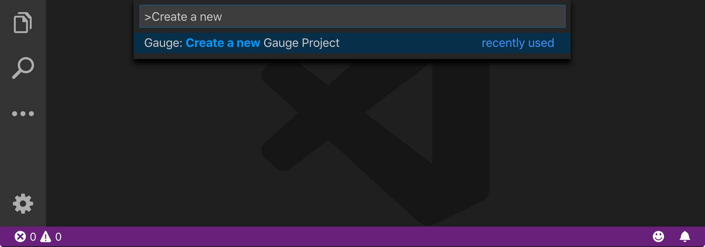

Step 2
~~~~~~

.. cssclass:: csharp dynamic-content

      Select the C# template to create the sample testing project

.. cssclass:: java dynamic-content

      Select the java template to create the sample testing project

.. cssclass:: javascript dynamic-content

      Select the js template to create the sample testing project

.. cssclass:: python dynamic-content

      Select the python template to create the sample testing project

.. cssclass:: ruby dynamic-content

      Select the ruby template to create the sample testing project

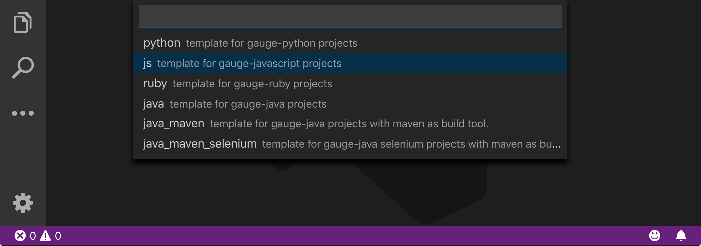

Step 3
~~~~~~

Choose a location to create a new folder to create a new project

.. cssclass:: macos dynamic-content
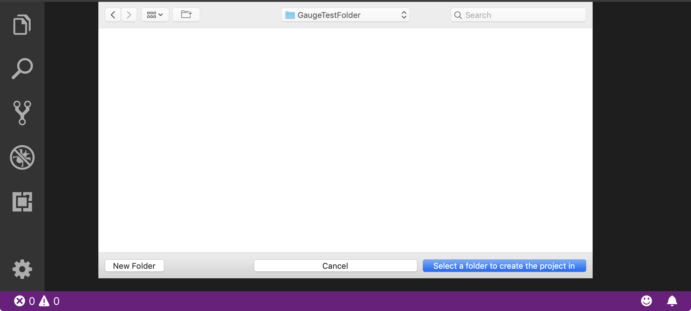

.. cssclass:: windows dynamic-content
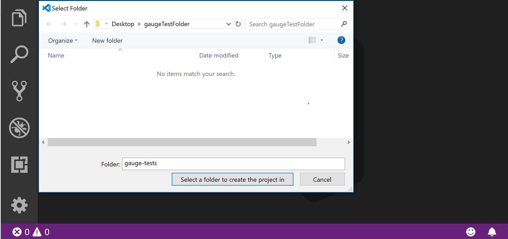

.. cssclass:: linux dynamic-content
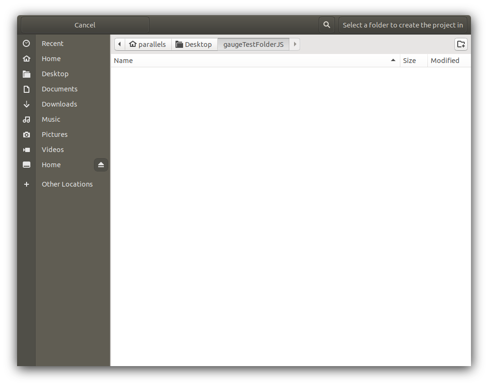

Step 4
~~~~~~

Give a name to your project

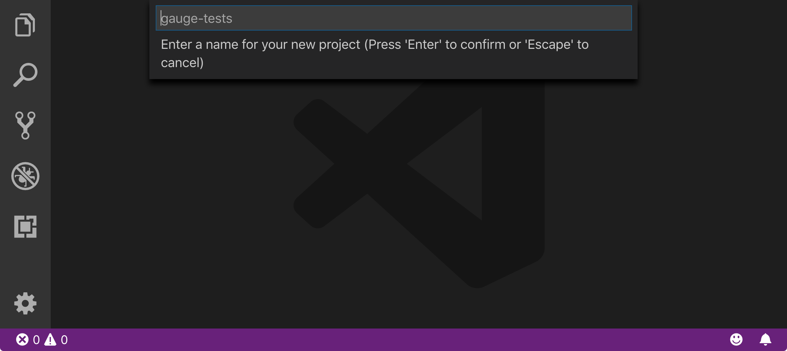

.. include:: folder_structure.rst

.. Note:: The file structure may vary depending on the language of your project. For this example, we have created a Javascript project.

.. cssclass:: javascript dynamic-content
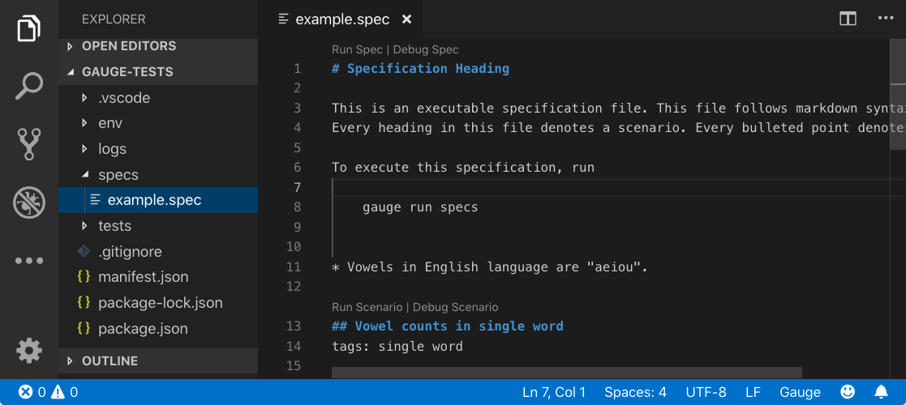

.. cssclass:: python dynamic-content
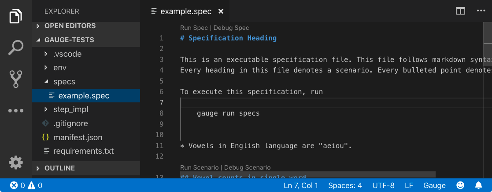

.. cssclass:: ruby dynamic-content
.. figure:: ../images/VSCode_Ruby_project_file_structure.png
      :alt: VSCode Ruby file structure

.. cssclass:: java dynamic-content
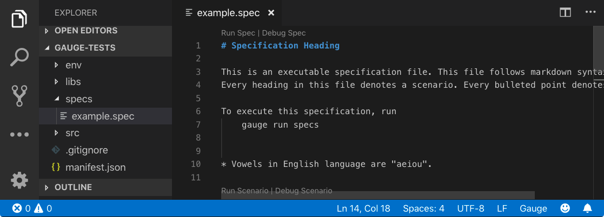

.. cssclass:: intellij dynamic-content

:intellij:`Creating a Testing Project in IntelliJ IDEA`
-------------------------------------------------------

Gauge projects can be created and executed in IntelliJ IDEA using the Gauge plugin for IntelliJ IDEA.

In this guide, you'll be able to learn how to add a sample Java testing project in IntelliJ IDEA

Step 1
~~~~~~

Once the plugin is installed, goto :highlighted-syntax:`File -> New Project`, select :highlighted-syntax:`Gauge` and click :highlighted-syntax:`Next`.

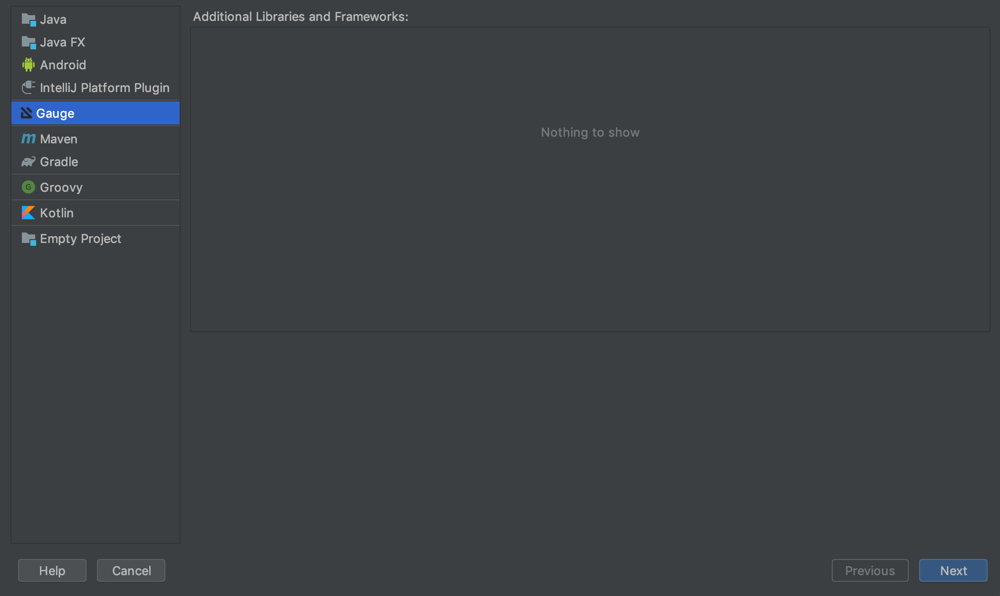

Step 2
~~~~~~

Choose the Project name, Project location, Project SDK and click :highlighted-syntax:`Finish`.

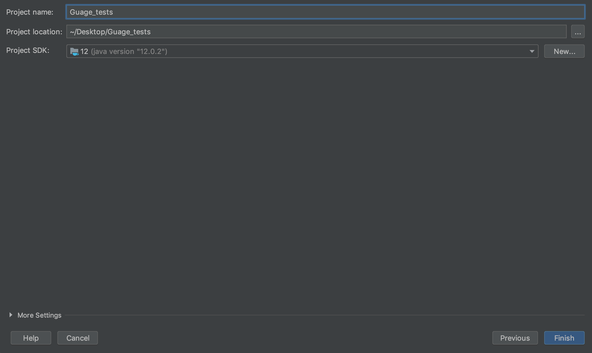

.. include:: folder_structure.rst

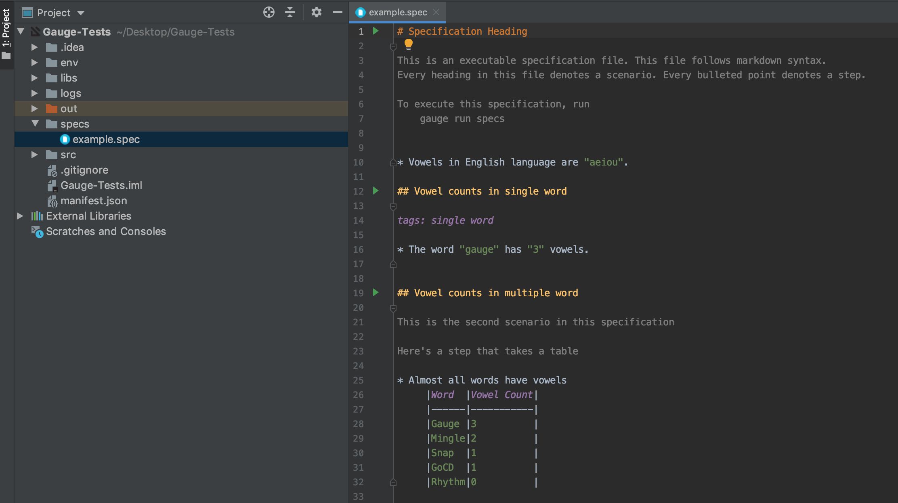

.. cssclass:: visualstudio dynamic-content

:visualstudio:`Creating a Testing Project in Visual Studio`
-----------------------------------------------------------

Gauge projects can be created and executed in Visual Studio using the Gauge extension for Visual Studio.

In this guide, you'll be able to learn how to add a sample C# testing project in Visual Studio

Step 1
~~~~~~

Once the Gauge extension is installed, goto :highlighted-syntax:`File -> New Project`, select :highlighted-syntax:`Gauge Test Project`.
Enter :highlighted-syntax:`Name`, :highlighted-syntax:`Location` and :highlighted-syntax:`Solution name` and click :highlighted-syntax:`Ok`.

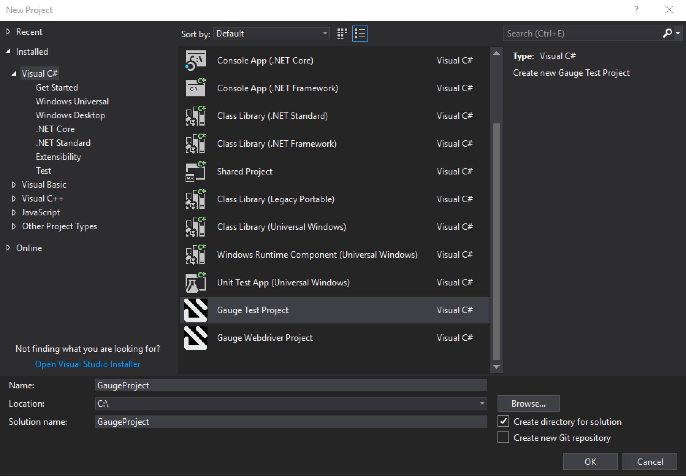

.. include:: folder_structure.rst

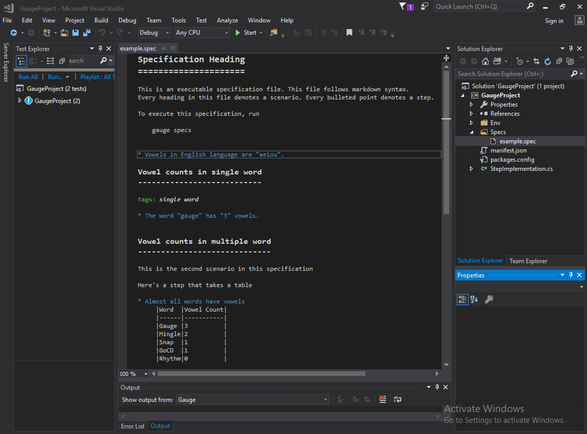

Next Step: Running a Specification
-----------------------------------

Now that you have successfully added/initialized a new Gauge testing project, we can look at how to run a specification by using the sample spec in the test folder

.. Note:: To learn more about how to test specifications in Gauge work and other gauge terminologies please look at our `Overview <../overview.html>`__  Section.

.. container:: page-navigator

   .. container:: navigate-previous

      `Installing Gauge <installing-gauge.html>`__

   .. container:: navigate-next

      `Running a Specification <running-a-specification.html>`__