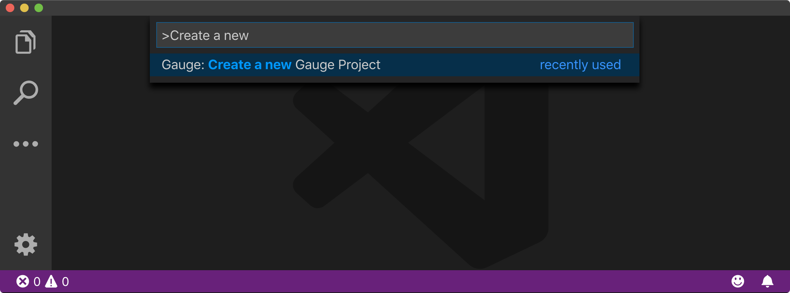
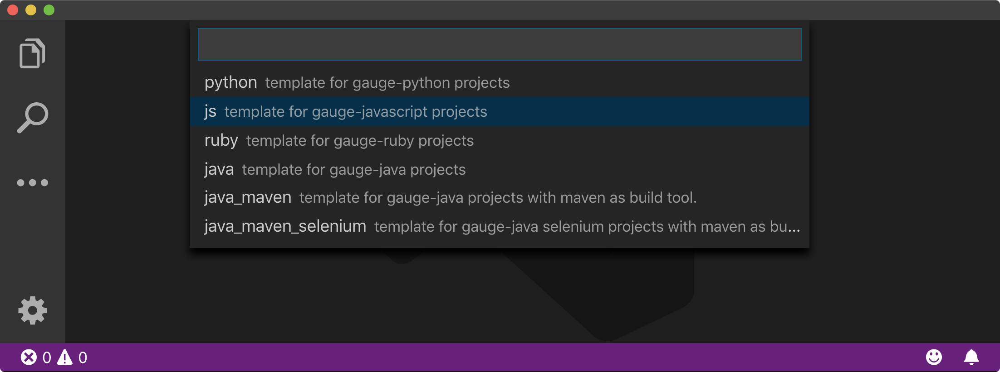
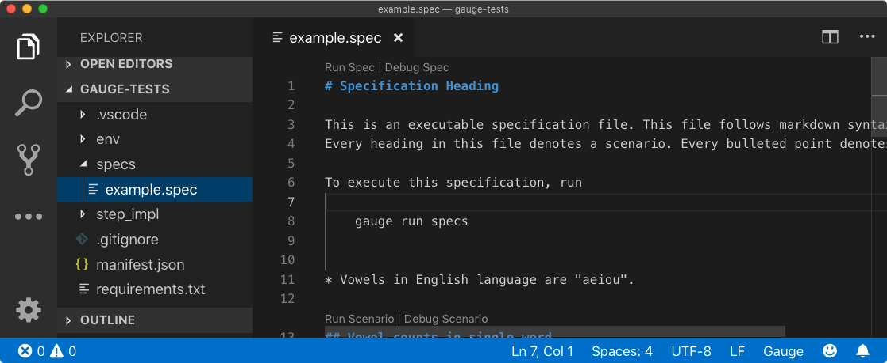
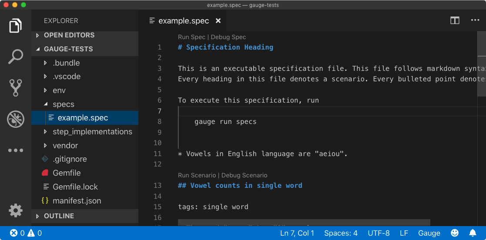
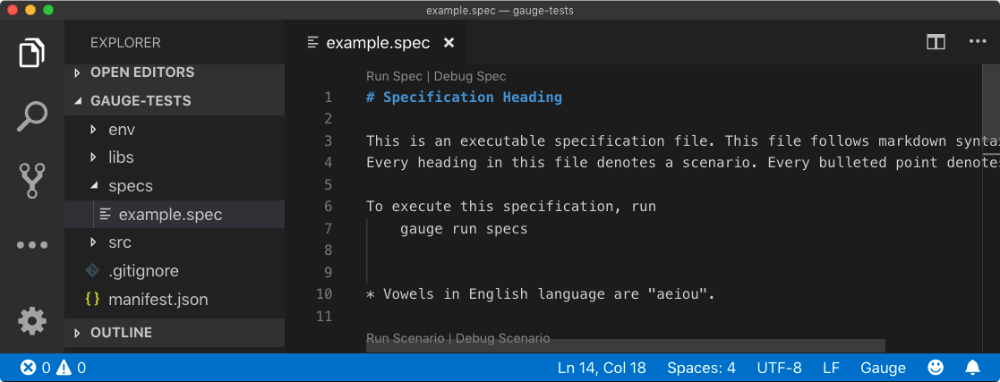

.. cssclass:: topic

.. cssclass:: page-navigator

    `Previous: Installing gauge <installing-gauge.html>`_
    `Next: Running a Specification <running-a-specification.html>`_
Create a Testing project using Gauge
====================================

.. include:: ../change_filter.rst

.. role:: highlighted-syntax

.. cssclass:: vscode dynamic-content
Creating a Testing Project in VS Code
-------------------------------------
Gauge projects can be created and executed in Visual studio code using the Gauge extension for VSCode.

In this guide, you'll be able to learn how to add a sample Javascript testing project in VSCode

Step 1
++++++

Once the extension is installed, press Cmd + shift + p to display the editor's command pallete, and then execute the following command to create a new testing project in Gauge:

:highlighted-syntax:`Gauge: Create new Gauge Project`

.. cssclass:: macos dynamic-content

Step 2
++++++

Select the JS template to create the sample testing project

.. cssclass:: macos dynamic-content

Step 3
Choose a location to create a new folder to create a new project

.. cssclass:: macos dynamic-content
.. figure:: ../images/mac/VSCode_create_project_select_folder.png
      :alt: Select project folder

Step 4
Give a name to your project

.. cssclass:: macos dynamic-content
.. fig: ../images/mac/VSCode_enter_project_name.png
      :alt: Enter project name

After you've successcreated a gauge project, you'll be able to see a sample project with an example specification.

.. cssclass:: macos javascript dynamic-content
.. figure:: ../images/mac/JS_folder_structure.png
      :alt: folder structure
.. cssclass:: macos python dynamic-content
.. figure:: ../images/mac/Python_folder_structure.png
      :alt: folder structure

.. cssclass:: macos ruby dynamic-content
.. figure:: ../images/mac/Ruby_folder_structure.png
      :alt: folder structure

.. cssclass:: macos java dynamic-content
.. figure:: ../images/mac/Java_folder_structure.png
      :alt: folder structure

.. Note:: The file structure may vary depending on the language of your project. For ts example, we have created a Javascript project.

.. cssclass:: macos javascript dynamic-content
.. figure:: ../images/mac/VSCode_JS_project_file_structure.png
      :alt: VSCode JS file structure

.. cssclass:: macos python dynamic-content

.. cssclass:: macos ruby dynamic-content

.. cssclass:: macos java dynamic-content

Next Step: Running a Specification
----------------------------------
Now that you have successfully added/initialized a new Gauge testing projec, we can look at how to run a specification by using the sample spec in the test folder

.. Note:: To learn more about how to test specifications in Gauge work and other gauge terminologies please look at our Overview Section.

.. cssclass:: page-navigator

    `Previous: Installing gauge <installing-gauge.html>`_
    `Next: Running a Specification <running-a-specification.html>`_
    