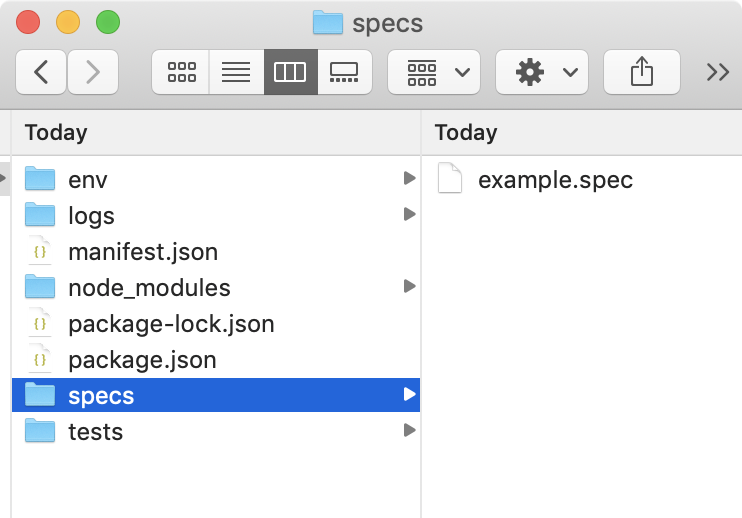

.. cssclass:: topic

Create a Testing project using Gauge
====================================

.. include:: ../change_filter.rst

.. role:: highlighted-syntax

.. cssclass:: windows-javascript-vscode display-content hidden

Creating a Testing Project in VS Code
-------------------------------------
Gauge projects can be created and executed in Visual studio code using the Gauge extension for VSCode.

In this guide, you'll be able to learn how to add a sample Javascript testing project in VSCode

Step 1
++++++

Once the extension is installed, press Ctrl + shift + p to display the editor's command pallete, and then execute the following command to create a new testing project in Gauge:

:highlighted-syntax:`Gauge: Create new Gauge Project`

Step 2
++++++

Select the JS template to create the sample testing project

Step 3
++++++

Choose a location to create a new folder to create a new project

Step 4
++++++

Give a name to your project

| After you've successfully created a gauge project, you'll be able to see a sample project with an example specification.

.. Note:: The file structure may vary depending on the language of your project. For this example, we have created a Javascript project.

.. cssclass:: macos-javascript-vscode display-content hidden

Creating a Testing Project in VS Code
-------------------------------------
Gauge projects can be created and executed in Visual studio code using the Gauge extension for VSCode.

In this guide, you'll be able to learn how to add a sample Javascript testing project in VSCode

Step 1
++++++

Once the extension is installed, press Cmd + shift + p to display the editor's command pallete, and then execute the following command to create a new testing project in Gauge:

:highlighted-syntax:`Gauge: Create new Gauge Project`

.. figure:: ../images/VSCode_create_gauge_project.png
      :alt: Select the template

Step 2
++++++

Select the JS template to create the sample testing project

.. figure:: ../images/VSCode_select_project_tempate.png
      :alt: Select the template

Step 3
++++++

Choose a location to create a new folder to create a new project

.. figure:: ../images/VSCode_create_project_select_folder.png
      :alt: Select the template

Step 4
++++++

Give a name to your project

.. figure:: ../images/VSCode_enter_project_name.png
      :alt: Select the template

| After you've successfully created a gauge project, you'll be able to see a sample project with an example specification.

.. Note:: The file structure may vary depending on the language of your project. For this example, we have created a Javascript project.

.. figure:: ../images/VSCode_project_file_structure.png
      :alt: Select the template

.. cssclass:: linux-javascript-vscode display-content hidden

Creating a Testing Project in VS Code
-------------------------------------
Gauge projects can be created and executed in Visual studio code using the Gauge extension for VSCode.

In this guide, you'll be able to learn how to add a sample Javascript testing project in VSCode

Step 1
++++++

Once the extension is installed, press Ctrl + shift + p to display the editor's command pallete, and then execute the following command to create a new testing project in Gauge:

:highlighted-syntax:`Gauge: Create new Gauge Project`

Step 2
++++++

Select the JS template to create the sample testing project

Step 3
++++++

Choose a location to create a new folder to create a new project

Step 4
++++++

Give a name to your project

| After you've successfully created a gauge project, you'll be able to see a sample project with an example specification.

.. Note:: The file structure may vary depending on the language of your project. For this example, we have created a Javascript project.

Next Step: Running a Specification
----------------------------------
Now that you have successfully added/initialized a new Gauge testing projec, we can look at how to run a specification by using the sample spec in the test folder

.. Note:: To learn more about how to test specifications in Gauge work and other gauge terminologies please look at our Overview Section.

.. cssclass:: page-navigator

    `Previous <installing-gauge.html>`_
    `Next <running-a-specification.html>`_
    