.. cssclass:: topic

Create a Testing project using Gauge
====================================

.. include:: ../change_filter.rst

.. role:: highlighted-syntax

.. cssclass:: vscode dynamic-content

Creating a Testing Project in VS Code
-------------------------------------
Gauge projects can be created and executed in Visual studio code using the Gauge extension for VSCode.

In this guide, you'll be able to learn how to add a sample Javascript testing project in VSCode

Step 1
++++++

Once the extension is installed, press Cmd + shift + p to display the editor's command pallete, and then execute the following command to create a new testing project in Gauge:

:highlighted-syntax:`Gauge: Create new Gauge Project`

.. figure:: ../images/VSCode_create_gauge_project.png
      :alt: Create project

Step 2
++++++

Select the JS template to create the sample testing project

.. figure:: ../images/VSCode_select_project_tempate.png
      :alt: Select template

Step 3
++++++

Choose a location to create a new folder to create a new project

.. cssclass:: macos dynamic-content
.. figure:: ../images/mac/VSCode_create_project_select_folder.png
      :alt: Select project folder

.. cssclass:: windows dynamic-content
.. figure:: ../images/windows/VSCode_create_project_select_folder.png
      :alt: Select project folder

Step 4
++++++

Give a name to your project

.. figure:: ../images/VSCode_enter_project_name.png
      :alt: Enter project name

After you've successcreated a gauge project, you'll be able to see a sample project with an example specification.

.. cssclass:: linux javascript dynamic-content
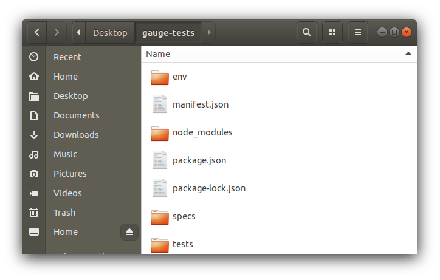

.. cssclass:: linux python dynamic-content
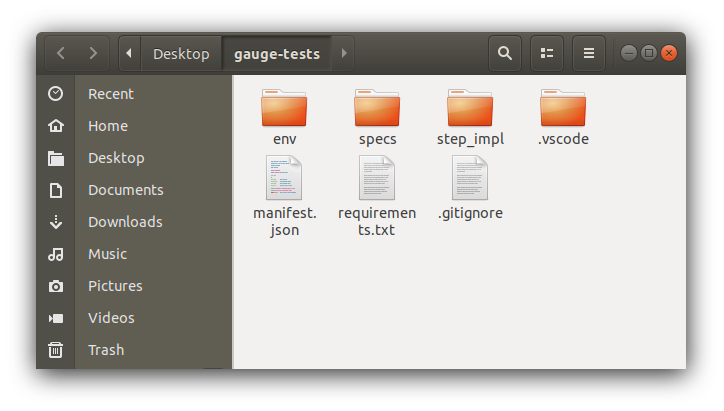

.. cssclass:: linux ruby dynamic-content
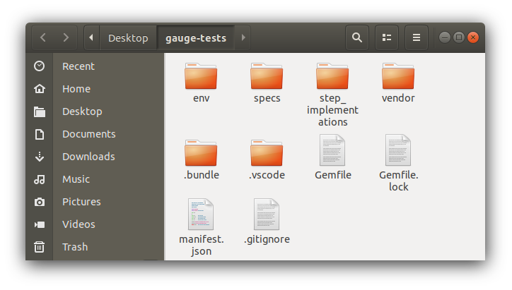

.. cssclass:: linux java dynamic-content
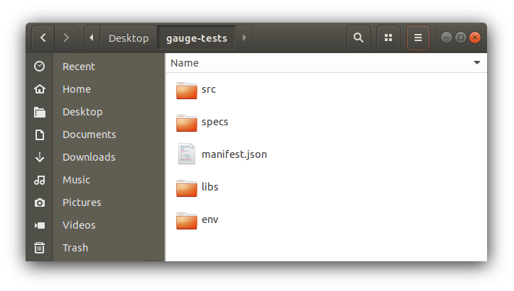

.. cssclass:: macos javascript dynamic-content
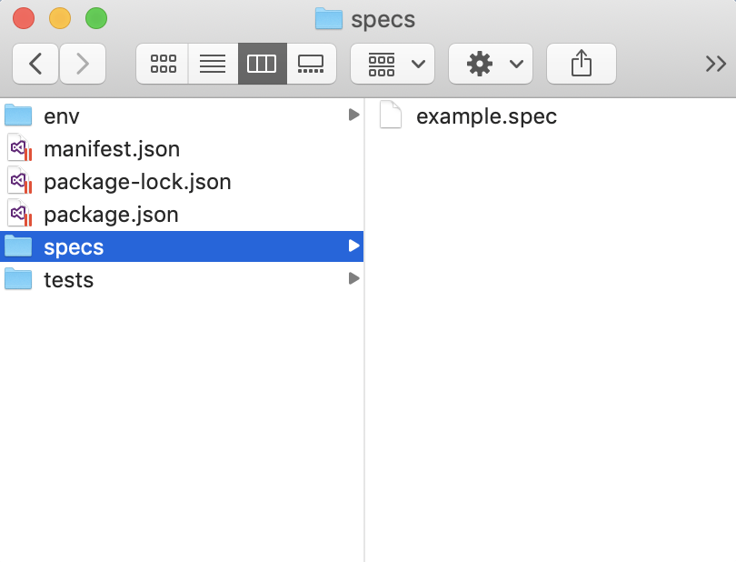

.. cssclass:: macos python dynamic-content
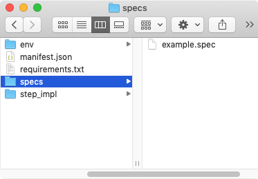

.. cssclass:: macos ruby dynamic-content
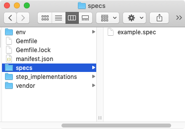

.. cssclass:: macos java dynamic-content
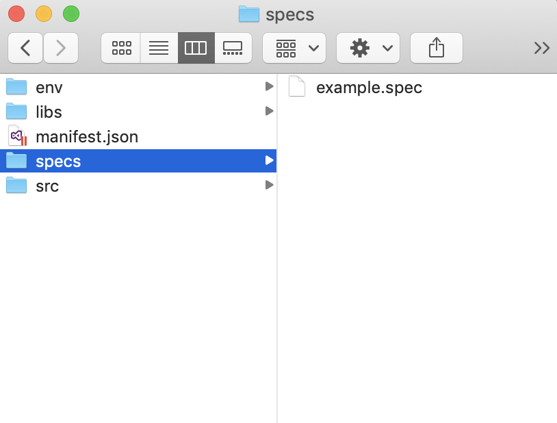

.. cssclass:: windows javascript dynamic-content
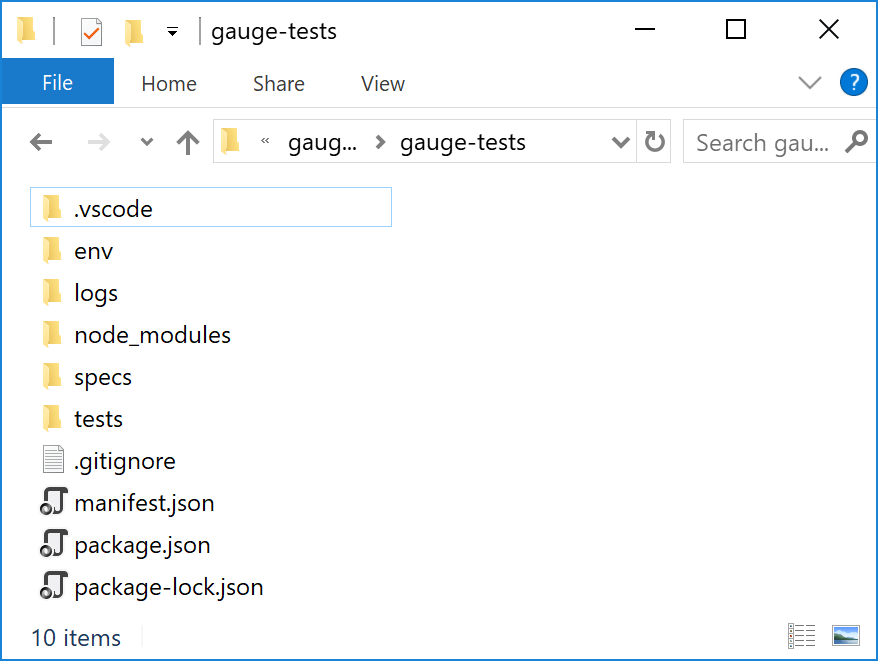

.. cssclass:: windows python dynamic-content
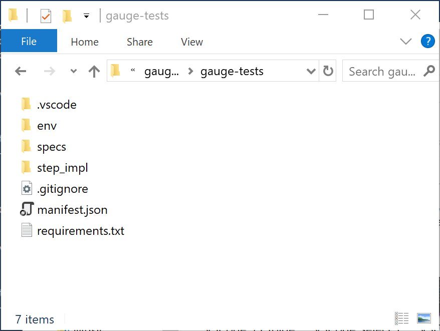

.. cssclass:: windows ruby dynamic-content
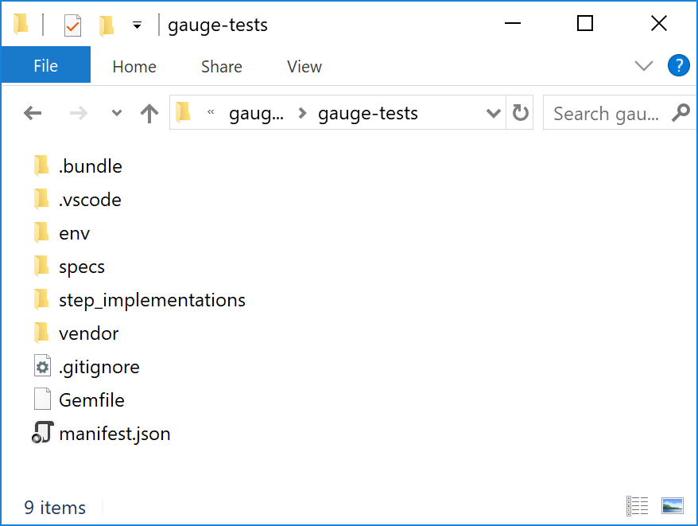

.. cssclass:: windows java dynamic-content
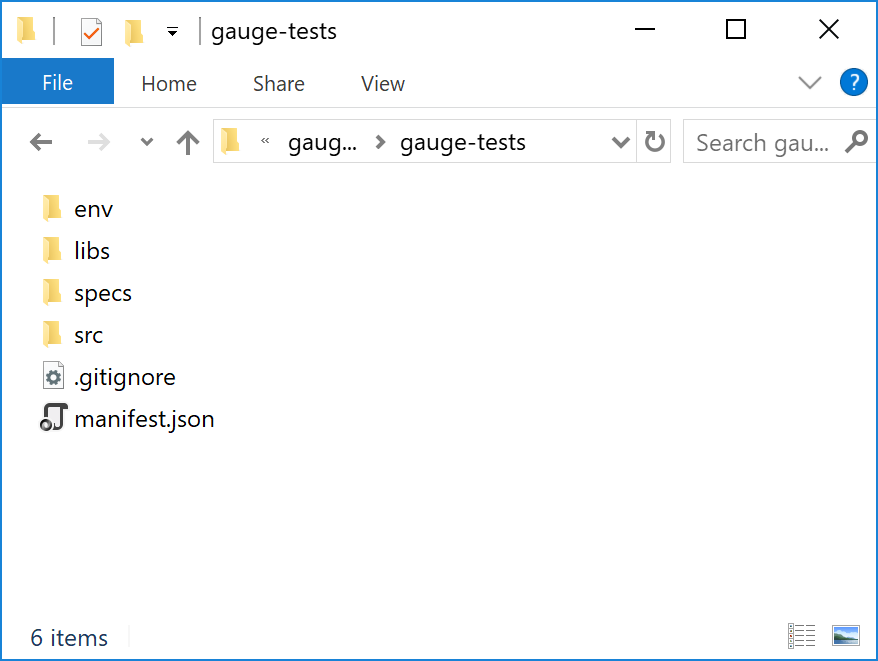

.. cssclass:: windows csharp dynamic-content
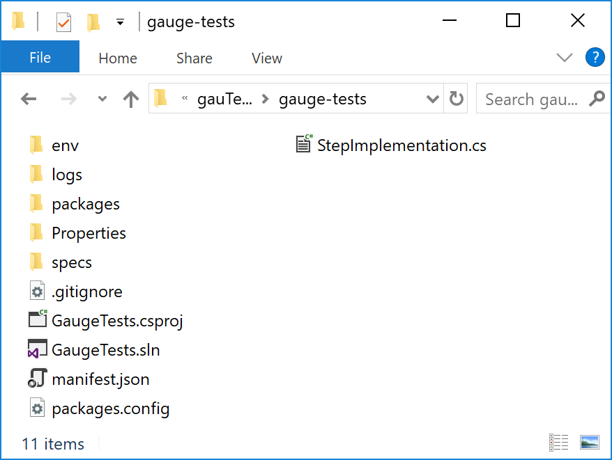

.. Note:: The file structure may vary depending on the language of your project. For ts example, we have created a Javascript project.

.. cssclass:: javascript dynamic-content
.. figure:: ../images/VSCode_JS_project_file_structure.png
      :alt: VSCode JS file structure

.. cssclass:: python dynamic-content
.. figure:: ../images/VSCode_Python_project_file_structure.png
      :alt: VSCode Python file structure

.. cssclass:: ruby dynamic-content
.. figure:: ../images/VSCode_Ruby_project_file_structure.png
      :alt: VSCode Ruby file structure

.. cssclass:: java dynamic-content
.. figure:: ../images/VSCode_Java_project_file_structure.png
      :alt: VSCode Java file structure

Next Step: Running a Specification
----------------------------------
Now that you have successfully added/initialized a new Gauge testing projec, we can look at how to run a specification by using the sample spec in the test folder

.. Note:: To learn more about how to test specifications in Gauge work and other gauge terminologies please look at our Overview Section.

.. container:: page-navigator

   .. container:: navigate-previous

      .. container:: navigation-text

         PREVIOUS

      .. container:: previous-symbol

         .. figure:: ../images/previous-angle.svg
            :alt: Previous

         `Installing Gauge <installing-gauge.html>`__
         
   .. container:: navigate-next

      .. container:: navigation-text
      
         NEXT

      .. container:: next-symbol

         `Running a Specification <running-a-specification.html>`__

         .. figure:: ../images/next-angle.svg
            :alt: Next
