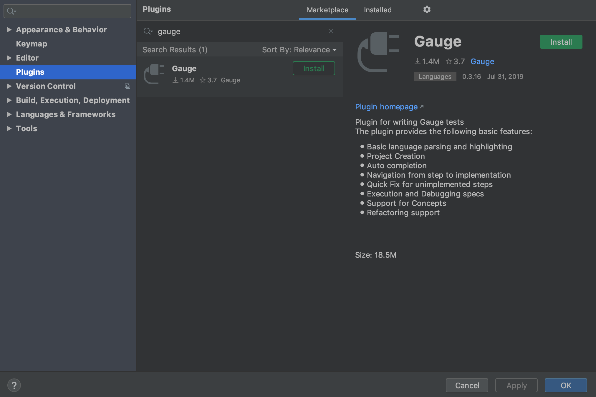

.. cssclass:: intellij dynamic-content

Installing Gauge extension for Intellij IDEA
============================================

.. cssclass:: code-block

.. admonition:: System Requirements

      `Latest Intellij IDEA <https://www.jetbrains.com/idea/download/>`__

Follow the steps to add the Gauge Intellij plugin from the IDE

1. Open the Settings dialog.

2. In the left-hand pane, select :highlighted-syntax:`Plugins`.

3. In the top pane, select :highlighted-syntax:`Marketplace`.

4. Type `Gauge` in the serach bar and click on :highlighted-syntax:`Install` option.

5. Once the installation is complete click on the :highlighted-syntax:`Restart IDE` to restart the IDE.

`Other install options <https://github.com/getgauge/Intellij-Plugin#installing-nightly>`__
