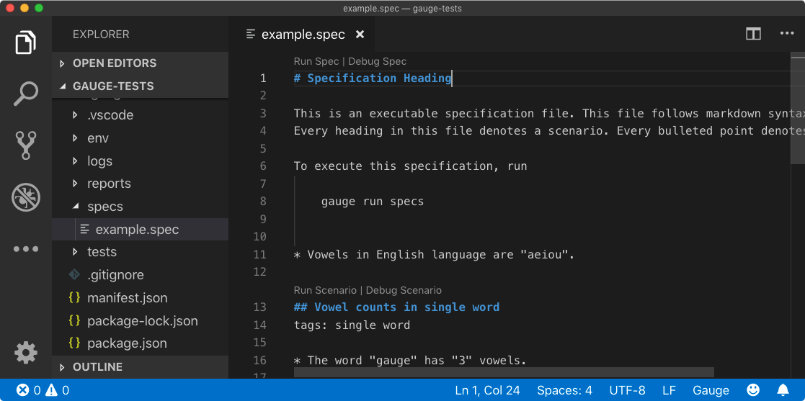
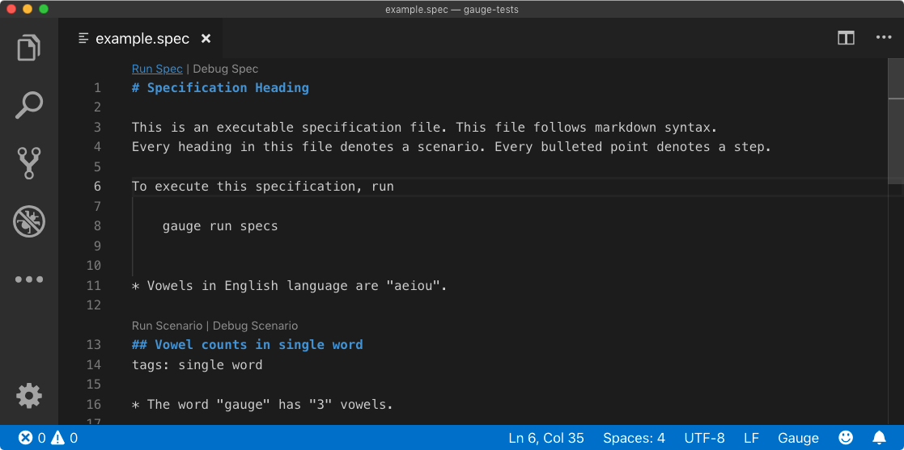
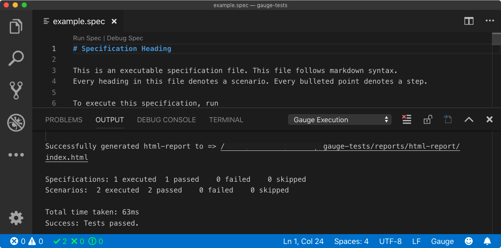

.. cssclass:: topic

Running a Specification
=======================

.. include:: ../change_filter.rst
.. role:: highlighted-syntax
.. role:: param-syntax-char

Now that you successfully initialized a Gauge project with the JavaScript template, we can look at
running a specification using the example spec in the test folder.

A test specification (spec) is a detailed statement of what will be tested. In Gauge, these are written
in a spec file.To learn more about how specifications work you can look at the owerview section.

.. cssclass:: macos-javascript-vscode display-content

Running a Specification using VS Code
---------------------------------------
Step 1
++++++
Open the example spec. The Gauge specification file is present under :highlighted-syntax:`/specs/example.spec`

Step 2
++++++
Run your Gauge specs in VS Code by choosing the option to :highlighted-syntax:`Run Spec`

You'll get immediate feedback in the output about what got executed.

.. cssclass:: macos-java-intellij display-content hidden
Running a Specification using Intellij
---------------------------------------
Step 1
++++++
Open the example spec. The Gauge specification file is present under :highlighted-syntax:`/specs/example.spec`

Step 2
++++++
Run your Gauge specs in Intellij

You'll get immediate feedback in the output about what got executed.

.. cssclass:: windows-csharp-visualstudio display-content hidden
Running a Specification using Visual Studio
---------------------------------------
Step 1
++++++
Open the example spec. The Gauge specification file is present under :highlighted-syntax:`/specs/example.spec`

Step 2
++++++
Run your Gauge specs in Visual Studio

You'll get immediate feedback in the output about what got executed.

Next Step:
----------
Now that you have successfully run a Gauge specification, you can go ahead and view the report from VS code.

.. cssclass:: page-navigator

    `Previous <create-test-project.html>`_
    `Next <view-a-report.html>`_