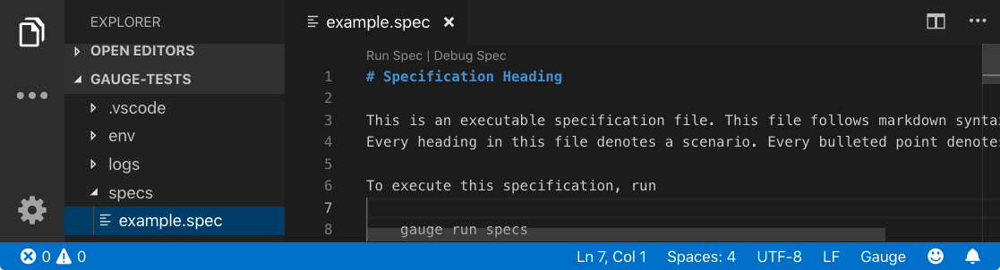
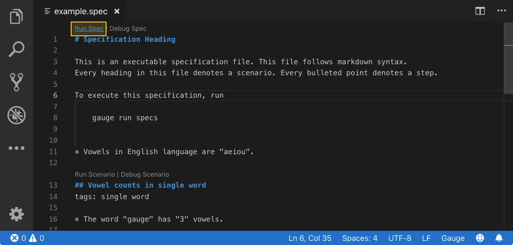
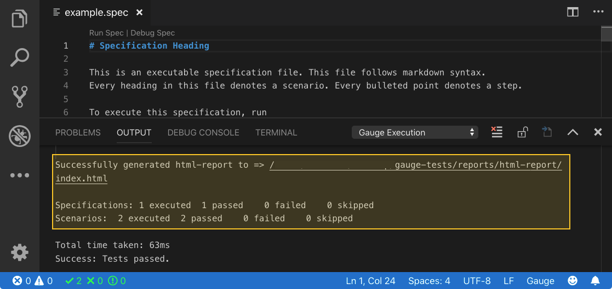
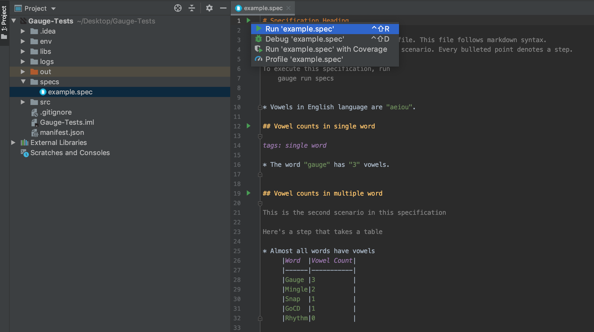
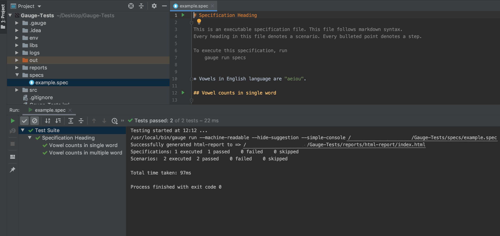

.. role:: heading
.. role:: vscode
.. role:: intellij
.. role:: visualstudio
.. cssclass:: topic

:heading:`Running a Specification`
==================================

.. include:: ../change_filter.rst
.. role:: highlighted-syntax
.. role:: param-syntax-char

Now that you successfully initialized a Gauge project with the JavaScript template, we can look at
running a specification using the example spec in the test folder.

A test specification (spec) is a detailed statement of what will be tested. In Gauge, these are written
in a spec file.To learn more about how specifications work you can look at the owerview section.

.. cssclass:: vscode dynamic-content

:vscode:`Running a Specification using VS Code`
================================================

Step 1
++++++
Open the example spec. The Gauge specification file is present under :highlighted-syntax:`/specs/example.spec`

Step 2
++++++
Run your Gauge specs in VS Code by choosing the option to :highlighted-syntax:`Run Spec`

You'll get immediate feedback in the output about what got executed.

.. cssclass:: java intellij dynamic-content

:intellij:`Running a Specification using Intellij`
===================================================
Step 1
++++++
Open the example spec. The Gauge specification file is present under :highlighted-syntax:`/specs/example.spec`

.. figure:: ../images/Intellij_open_example.spec.png
      :alt: Open example.spec file

Step 2
++++++
Run your Gauge specs in Intellij by clicking on the :highlighted-syntax:`Run example.spec`.

You'll get immediate feedback in the output about what got executed.

.. cssclass:: csharp visualstudio dynamic-content

:visualstudio:`Running a Specification using Visual Studio`
===========================================================
Step 1
++++++
Open the example spec. The Gauge specification file is present under :highlighted-syntax:`/specs/example.spec`

Step 2
++++++
Run your Gauge specs in Visual Studio

You'll get immediate feedback in the output about what got executed.

Next Step:
==========
Now that you have successfully run a Gauge specification, you can go ahead and view the report from VS code.

.. container:: page-navigator

   .. container:: navigate-previous

      `Create a Test Project <create-test-project.html>`__

   .. container:: navigate-next

      `Viewing a Report <view-a-report.html>`__