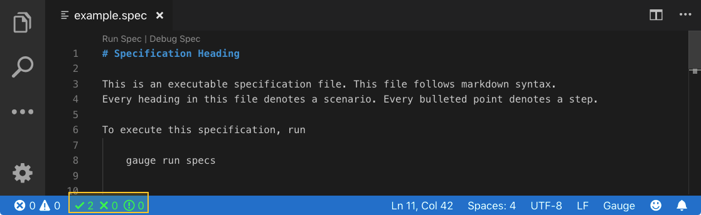
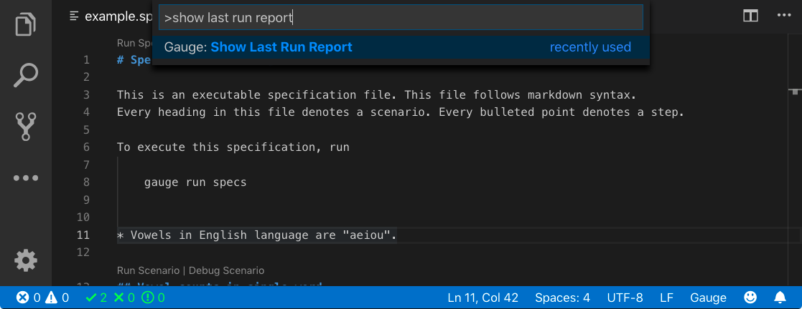
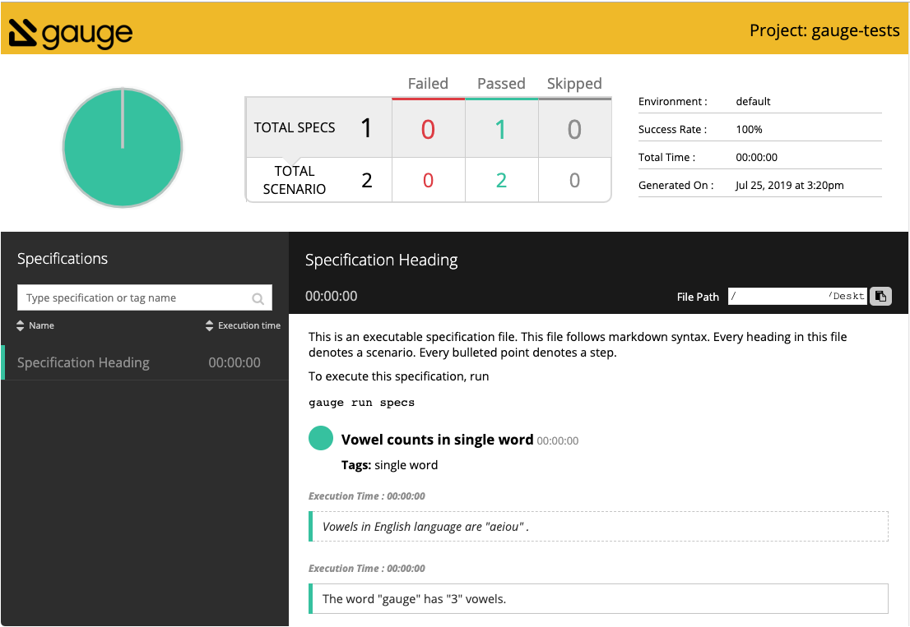

.. meta::
    :description: This is a quick overview of how to view the report of last test run. It guides you through how to view report of last execution on different os, in different languages, and on different ides...
    :keywords: view report testing project vscode idea visualstudio automation

.. role:: heading
.. role:: vscode
.. role:: intellij
.. role:: visualstudio
.. cssclass:: topic

:heading:`Viewing Reports`
==========================

.. include:: ../change_filter.rst

.. cssclass:: vscode dynamic-content

:vscode:`Viewing Reports from Visual Studio Code`
-------------------------------------------------

Once the specifications are run you will get immediate feedback in the output screen of Visual Studio Code.

Once you've run the sample spec, you can view the HTML report of the tests run by following either of the steps below:

Open the html report by clicking on the view summary link in Visual Studio Code

OR

In the editor's command pallete type Gauge: Show Last Run Report to view the report in the browser

Here's what a Gauge report looks like.

.. cssclass:: intellij dynamic-content

:intellij:`Viewing Reports from IntelliJ IDEA`
----------------------------------------------

Once the specifications are run you will get immediate feedback in the output screen of IntelliJ IDEA.

Once you've run the sample spec, you can view the HTML report of the tests run by opening the :highlighted-syntax:`index.html` file available in :highlighted-syntax:`$PROJECT_ROOT/reports/html-report/index.html`

Here's what a Gauge report looks like.

.. cssclass:: visualstudio dynamic-content

:visualstudio:`Viewing Reports from Visual Studio`
--------------------------------------------------

Once the specifications are run you will get immediate feedback in the output screen of Visual Studio.

Once you've run the sample spec, you can view the HTML report of the tests run by opening the :highlighted-syntax:`index.html` file available in :highlighted-syntax:`$PROJECT_ROOT/reports/html-report/index.html`

Here's what a Gauge report looks like.

Next Step:
----------

And, that concludes our getting started journey for Gauge. Hopefully this helped you install and set-up your first Gauge project. Gauge comes with powerful language & tool support as well as a versatile reporting functionality. We've covered the basics for all of these features in this guide.

As a next step, the following resources are available:

.. cssclass:: text-box

    * `Write Specifications  <../writing-specifications.html>`__: This section has more in-depth detail on writing Gauge specifications and connecting them with the test scripts of your choice.

    * `Examples <../examples-and-tutorials.html>`__: The examples section contains example projects of different languages and tools to help you get started with exactly what you need.
    
    * `Taiko Documentation <https://taiko.gauge.org/>`__:  The Taiko documentation site has all information you need to start recording test scripts using Taiko.

.. container:: page-navigator

    .. container:: navigate-previous

        `Running a Specification <running-a-specification.html>`__