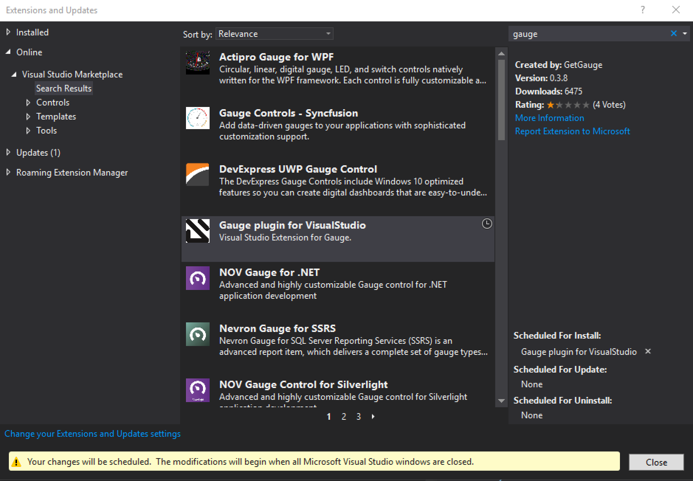

.. cssclass:: visualstudio dynamic-content
.. role:: visualstudio

:visualstudio:`Step 2: Installing Gauge extension for Visual Studio`
====================================================================

.. cssclass:: code-block

.. admonition:: System Requirements

      `Visual Studio 2017 <https://visualstudio.microsoft.com/vs/older-downloads/>`__
      
      `Gauge Visual Studio Templates <https://marketplace.visualstudio.com/items?itemName=vs-publisher-1071478.gauge-visualstudio-templates>`__

Follow the steps to add the Gauge Visual Studio plugin from the IDE

1. Open Visual Studio Extension Manager from :highlighted-syntax:`Tools -> Extensions and Updates`.

2. In the left-hand pane, select :highlighted-syntax:`Online` and search for :highlighted-syntax:`gauge` on the right-hand pane and click on the :highlighted-syntax:`Download` option.

.. figure:: ../images/VisualStudio_search_gauge_plugin.png
      :alt: Search gauge

3. Once the download is complete close all Visual Studio windows to apply the changes.

