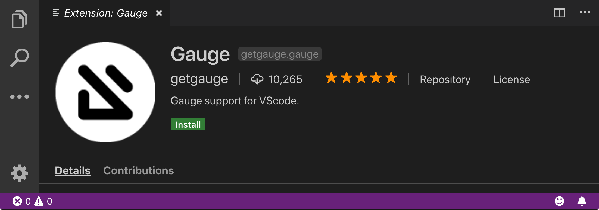

.. cssclass:: vscode dynamic-content
.. role:: vscode

:vscode:`Step 2: Installing Gauge extension for VSCode`
=======================================================

.. cssclass:: code-block

.. admonition:: System Requirements

      `Latest VSCode <https://code.visualstudio.com/>`__

Follow the steps to add the Gauge VSCode code plugin from the IDE

| 1. Install the following Gauge extension for VSCode.

.. cssclass:: extension-link

`Gauge extension <https://marketplace.visualstudio.com/items?itemName=getgauge.gauge>`__

.. cssclass:: vscode-installation-note
.. note::
      You can install VS Code by

| 2. On the extension page that opens in the IDEs, click the install button

.. cssclass:: other-install-options

`Other install options <https://marketplace.visualstudio.com/items?itemName=getgauge.gauge#install-from-source>`__
