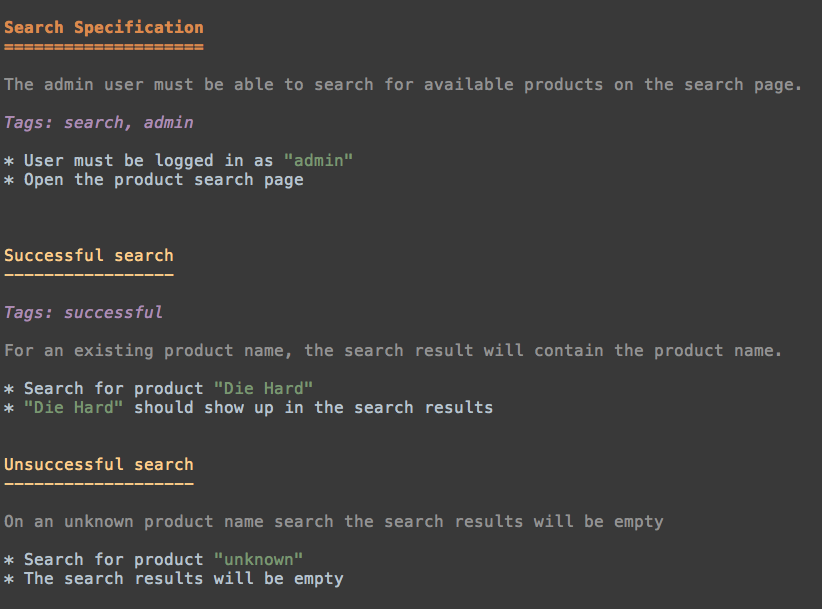

Long Start
==========

Why Gauge?
----------

The communication breakdowns between Developers and Business
Stakeholders is a common risk of software development. Gauge is an
advanced automation tool that allows requirements to be written in a way
that will be understood by all roles in a project and help bridge the
gap.

Some of the **key features** of Gauge that make it stand unique include:

-  A rich markup based on
   `markdown <https://en.wikipedia.org/wiki/Markdown>`__
-  Simple, Flexible and Rich Syntax
-  Business Language Tests : Supports the concept of `executable
   documentation <advanced_readings/living_documentation.md>`__
-  Consistent Cross Platform/Language Support for writing test code.
   Currently :ref:`supported languages <install-language-runner>`.
-  Open Source, so it could be shared freely and improved by others as
   well
-  A modular architecture with :doc:`plugins` support.
-  Extensible through :doc:`plugins` and Hackable
-  Supports External Data Sources
-  Helps you create Maintainable and Understandable test suites
-  `IDE Support <ide_support/README.md>`__

Specifications (spec)
---------------------

They are business layer test cases which can also act as your feature
documentation. They are written in the business language. Typically a
spec or specification describe a particular feature of the application
under test.

-  They are written in a ``.spec`` file. Gauge also supports ``.md``
   file format.
-  The Markup for a Specification file is based on
   `markdown <https://en.wikipedia.org/wiki/Markdown>`__ syntax.

Example
^^^^^^^

   Spec

Specification Heading
---------------------

A Spec must begins with a spec heading and a single specification can
contain only one spec heading.

It is written in ``<H1>`` syntax of markdown. This can be in two
forms:

::

    Spec Heading
    ============

or

::

    # Spec Heading

-  Every spec must contain one or more :ref:`longstart-scenarios`.
-  Every spec can be marked with labels using :ref:`longstart-tags`.

.. _longstart-scenarios:

Scenarios
---------

Each scenario represents a single flow in a particular specification. A
specification must contain at least one scenario.

A scenario starts after a scenario heading or a scenario name. The
scenario heading is written in markdown ``<H2>`` syntax. This can be
written in 2 ways:

::

    Scenario heading
    ----------------

or

::

    ## Scenario heading

-  A scenario contains one or more `steps <steps.md>`__ under it.
-  A scenario can be tagged using `tags <tags.md>`__.

Example
^^^^^^^

::

    Configuration
    =============

    The Admin user should be able to switch permissions for other users.

    Admin Login
    -----------
    * User must login as "admin"
    * Navigate to the configuration page
    * Change permissions for user "john" to "admin"
    * User "john" should have admin permissions

.. _longstart-steps:

Steps
-----

Steps are the executable components of your specification. They are
written as markdown unordered list items (bulleted points).

They are written inside a specification as 

   - :ref:`Context Steps<longstart-context>`
   - :ref:`longstart-teardown`
   - Steps inside a scenario or concepts

Every step has an underlying code implementation for the programming
language used. This is executed when the steps inside a spec are
executed.

See how to write :ref:`language-steps` for different languages.

Example
^^^^^^^

::

    * Login into my app
    * Search for "gauge"
    * Search for "gauge-java"

The values written in **quotes** are parameters which are passed into
the underlying step implementation as a language specific structure.

Note: The following characters are reserved for parameters, these
cannot be used in step text. 

   - " 
   - < 
   - >

Parameters
----------

Steps can be defined to take values as parameters so that they can be
re-used with different parameter values.

::

    * Check "product 1" exists
    * Check "product 2" exists

The underlying :ref:`step implementation <language-steps>` in
code must also take the same number of parameters as passed from the
step.

The parameters passed into a step are of the following types:

Simple parameters
^^^^^^^^^^^^^^^^^

They are values passed into the steps in double quotes.

::

    * Create a “gauge-java” project
    * Write “100” line specification

**Note:** Renaming the parameter will not rename the usages inside the
method. By design, the renamed parameter is considered as a new parameter.
Therefore the usage of the old parameter(if any) has to be fixed
manually to resolve the corresponding compilation issue.

Table Parameter
^^^^^^^^^^^^^^^

Table Parameters can be used in two ways

-  When a scenario or multiple scenarios in a specification are to be
   executed for multiple sets of data then Data table execution can be
   used.
-  Tables or inline tables can be passed to steps as parameters.

Data Table values in inline tables
^^^^^^^^^^^^^^^^^^^^^^^^^^^^^^^^^^

Dynamic values from the data table can also be referred in table
parameters passed into steps

Example
~~~~~~~

::

    Create projects
    ===============

    |id| name |
    |--|------|
    |1 | john |
    |2 | mike |

    First scenario
    --------------

    * Create the following projects
         |project name| username |
         |------------|----------|
         | Gauge java | <name>   |
         | Gauge ruby | <name>   |

In the above example the table parameter uses a dynamic value from the
data table.

Special Parameters
^^^^^^^^^^^^^^^^^^

Special parameters provide the ability to pass larger and richer data
into the steps as parameters. 

   - They are entered in angular brackets - ``<>`` in the step. 
   - They contain 2 parts separated by a colon ``:``

::

    <prefix:value>

**Prefix** : This defines the type of special parameter. e.g. file,
table.

**Value** : This defines the value for the type of special parameter.

There are two types of special paramters:

File
~~~~

These are used to read files and pass the file content as a string
parameter to the underlying steps.

The prefix and value are below:

**Prefix** : ``file``

**Value** : The value is the path to the file.

::

    * Verify email text is <file:email.txt>
    * Check if <file:/work/content.txt> is visible

The path to the file can be the relative path from the Gauge project or
an absolute path to the file.

CSV
~~~

Tables are used to pass table value into steps read from an external CSV
file. The parameter text in the step contains a prefix table and the
path to the csv file.

**Prefix** : ``table``

**Value** : The value is the path to the csv file.

::

    * Step that takes a table <table:data.csv>
    * Check if the following users exist <table:/Users/john/work/users.csv>

**Sample csv file**:

::

    Id,Name
    1,The Way to Go On
    2,Ivo Jay Balbaert

The first row is considered as table header. Following rows are
considered as the row values.

.. _longstart-tags:

Tags
----

Tags are used to associate labels with specifications or scenarios. Tags are written as comma separated values in the spec with a prefix ``Tags:`` .

-  Both scenarios and specifications can be separately tagged
-  Only **one** set of tags can be added to a single specification or
   scenario.

They help in filtering specs or scenarios based on tags used.

Example
^^^^^^^

Both the ``Login specification`` and the scenario
``Successful login scenario`` have tags in the below example.

::

    Login specification
    ===================
     Tags: login, admin, user-abc

    Successful login scenario
    -------------------------
     Tags: login-success, admin

A tag applied to a spec automatically applies to a scenario.

Concepts
--------

Concepts provide the ability to combine re-usable logical groups of
steps into a single unit. It provides a higher level abstraction of a
business intent by combining steps.

They are defined in ``.cpt`` format files in the ``specs`` directory
in the project. They can be inside nested directories inside the specs
directory.

-  Concepts are used inside spec just like any other step. The
   appropriate parameters are passed to them.
-  On execution all the steps under the concepts are executed in the
   defined order.

**Note:** A single .cpt file can contain multiple concept definitions.

Defining a concept
^^^^^^^^^^^^^^^^^^

Create a ``.cpt`` file under specs directory with the concept
definition.

The concept definition contains the 2 parts:

Concept header
~~~~~~~~~~~~~~

The concept header defines the name of the concept and the parameters
that it takes. It is written in the markdown **``H1``** format.

-  All parameters are defined in angular brackets ``< >``.
-  A concept definition must have a concept header.

::

    # Concept name with <param0> and <param1>

Steps
~~~~~

The concept header is followed by the steps that are used inside the
concept. They are defined in the usual `step <steps.md>`__ structure.

-  All the parameters used from the concept header will be in ``< >``
   brackets.
-  Fixed static parameter values are written in quotes ``" "``.
-  Other concepts can also be called inside the concept definition.

::

    # Login as user <username> and create project <project_name>

    * Login as user <username> and "password"
    * Navigate to project page
    * Create a project <project_name>

In the above example:

-  The first line is the concept header
-  The following 3 steps are abstracted into the concept

.. _longstart-context:

Contexts
--------

**Contexts** or **Context steps** are steps defined in a spec before any
scenario.

They allow you to specify a set of conditions that are necessary for
executing scenarios in a spec. Context steps can be used to set up data
before running scenarios. They can also perform a setup or tear down
function.

-  Any regular `step <steps.md>`__ can be used as a context.
-  Contexts are executed before every scenario in the spec.

::

    Delete project
    ==============
    These are context steps

    * User is logged in as "mike"
    * Navigate to the project page

    Delete single project
    ---------------------
    * Delete the "example" project
    * Ensure "example" project has been deleted

    Delete multiple projects
    ------------------------
    * Delete all the projects in the list
    * Ensure project list is empty

In the above example spec the context steps are ``User is logged in as Mike`` and
``Navigate to the project page``, they are defined before any
scenario.

These steps are executed before the execution of each scenario ``Delete single project`` and ``Delete multiple projects``.

The spec execution flow would be:

1. Context steps execution
2. ``Delete single project`` scenario execution
3. Context steps execution
4. ``Delete multiple projects`` scenario execution

.. _longstart-teardown:

Tear Down Steps
---------------

**Tear Down Steps** are the steps defined in a spec after the last
scenario. They allow you to specify a set of clean-up steps after every
execution of scenario in a spec. They are used to perform a tear down
function.

-  Any regular `step <steps.md>`__ can be used as a tear down step.
-  Tear down steps are executed after every scenario in the spec.

Syntax
^^^^^^

``___``: Three or more consecutive underscores will indicate the start
of tear down. Steps that are written in tear down(after three or more
consecutive underscores) will be considered as tear down steps.

::

    ___
    * Tear down step 1
    * Tear down step 2
    * Tear down step 3

Example
^^^^^^^

::

    Delete project
    ==============

    * Sign up for user "mike"
    * Log in as "mike"

    Delete single project
    ---------------------
    * Delete the "example" project
    * Ensure "example" project has been deleted

    Delete multiple projects
    ------------------------
    * Delete all the projects in the list
    * Ensure project list is empty

    ____________________
    These are teardown steps

    * Logout user "mike"
    * Delete user "mike"

In the above example spec, the tear down steps are
``Logout user "mike"`` and ``Delete user "mike"``, they are
defined after three or more consecutive underscores.

The spec execution flow would be:

1. Context steps execution
2. ``Delete single project`` scenario execution
3. Tear down steps execution
4. Context steps execution
5. ``Delete multiple projects`` scenario execution
6. Tear down steps execution
