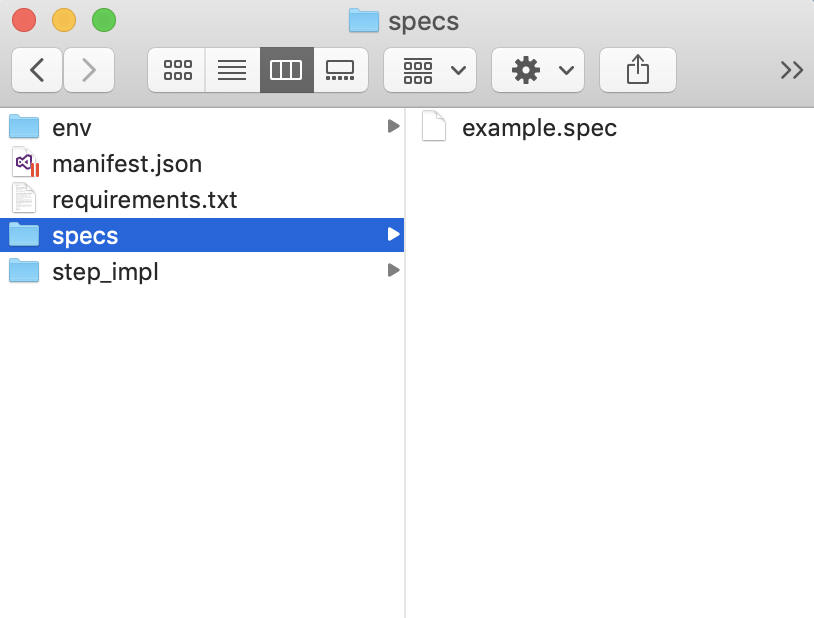
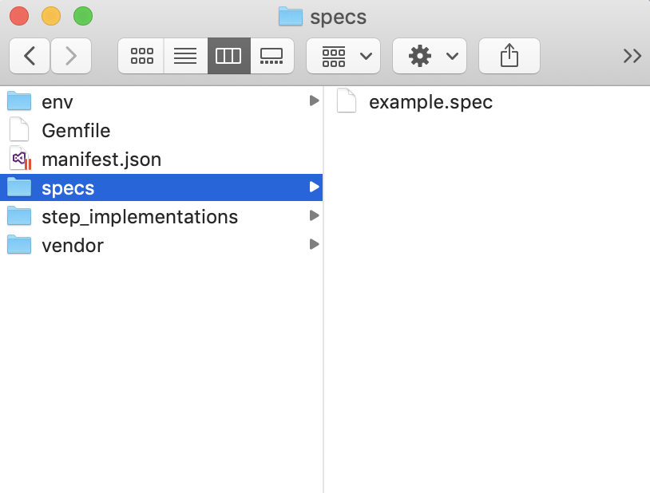
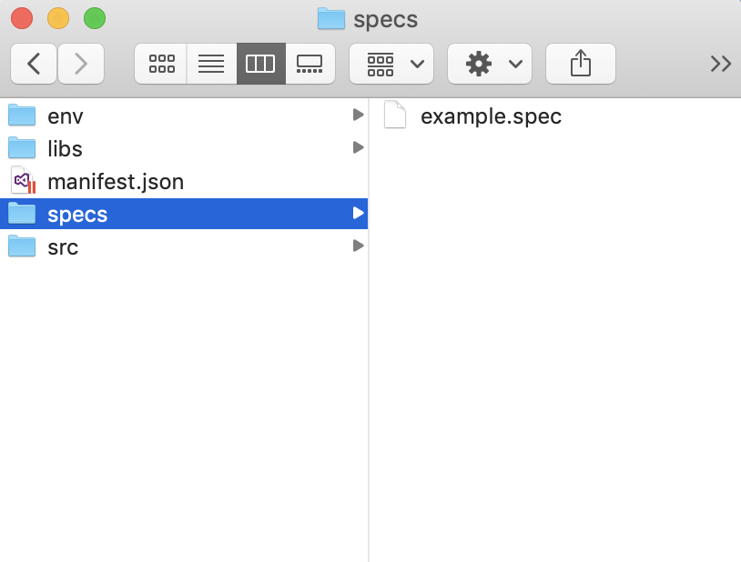

After you've successfully created a gauge project, you'll be able to see a sample project with an example specification.

.. cssclass:: linux javascript dynamic-content
.. figure:: ../images/linux/JS_folder_structure.png
      :alt: folder structure

.. cssclass:: linux python dynamic-content
.. figure:: ../images/linux/Python_folder_structure.png
      :alt: folder structure

.. cssclass:: linux ruby dynamic-content
.. figure:: ../images/linux/Ruby_folder_structure.png
      :alt: folder structure

.. cssclass:: linux java dynamic-content
.. figure:: ../images/linux/Java_folder_structure.png
      :alt: folder structure

.. cssclass:: macos javascript dynamic-content
.. figure:: ../images/mac/JS_folder_structure.png
      :alt: folder structure

.. cssclass:: macos python dynamic-content

.. cssclass:: macos ruby dynamic-content

.. cssclass:: macos java dynamic-content

.. cssclass:: windows javascript dynamic-content
.. figure:: ../images/windows/JS_folder_structure.png
      :alt: folder structure

.. cssclass:: windows python dynamic-content
.. figure:: ../images/windows/Python_folder_structure.png
      :alt: folder structure

.. cssclass:: windows ruby dynamic-content
.. figure:: ../images/windows/Ruby_folder_structure.png
      :alt: folder structure

.. cssclass:: windows java dynamic-content
.. figure:: ../images/windows/Java_folder_structure.png
      :alt: folder structure

.. cssclass:: windows csharp dynamic-content
.. figure:: ../images/windows/Csharp_folder_structure.png
      :alt: folder structure

