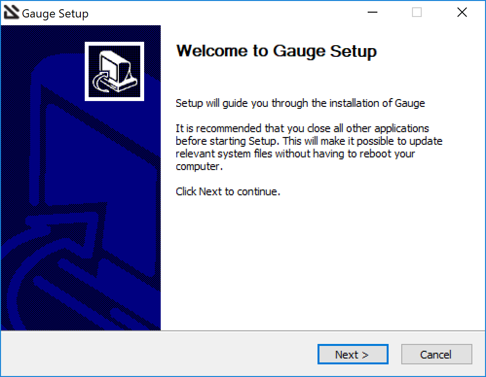

.. role:: installer-icon
.. role:: windows
.. role:: alternate-methods

.. cssclass:: dynamic-content windows

:windows:`Step 1: Installing Gauge on Windows`
~~~~~~~~~~~~~~~~~~~~~~~~~~~~~~~~~~~~~~~~~~~~~~

This section gives specific instructions on setting up Gauge in a Microsoft Windows environment.

:installer-icon:`Install using Windows Installer`
^^^^^^^^^^^^^^^^^^^^^^^^^^^^^^^^^^^^^^^^^^^^^^^^^

Download the following installation bundle to get the latest stable release of Gauge.

.. cssclass:: extension-link download-icon

`Windows Installer <https://github.com/getgauge/gauge/releases/download/vGAUGE_LATEST_VERSION_PLACEHOLDER/gauge-GAUGE_LATEST_VERSION_PLACEHOLDER-windows.x86_64.exe>`__

Once you finished installing Gauge, you can go ahead and `install the Gauge Extension for Visual Studio Code Plugin <#step-2-installing-gauge-extension-for-vscode>`__

.. cssclass:: alternate-installation

:alternate-methods:`Alternate Installation Methods`

.. cssclass:: collapsible first

:installer-icon:`Install using Chocolatey Package Manager`
^^^^^^^^^^^^^^^^^^^^^^^^^^^^^^^^^^^^^^^^^^^^^^^^^^^^^^^^^^

.. cssclass:: code-block toggle collapsible-content

    .. admonition:: System Requirements

        `Chocolatey Package Manager <https://chocolatey.org/>`__

    For this to work, you will need to install Chocolatey. If you have chocolatey installed then all you need to is to follow the steps below, it will download and install Gauge.

.. cssclass:: toggle collapsible-content
.. note::
    Some of the following instructions mention the "command prompt". Where this is used, it refers to the Windows cmd.

.. cssclass:: toggle collapsible-content

* To open your Command Prompt, click your Start Button
* In Search type, "cmd"
* Then click on "Command Prompt"
* Type the following command in your Command Prompt to install Gauge.

.. cssclass:: toggle collapsible-content
.. code-block:: console

    choco install gauge

.. cssclass:: collapsible zip-installer

:installer-icon:`Install using Zip file`
^^^^^^^^^^^^^^^^^^^^^^^^^^^^^^^^^^^^^^^^

.. cssclass:: toggle collapsible-content

    .. admonition:: System Requirements

        - Powershell

    1. Download the following zip installer.

        `Zip Installer <https://github.com/getgauge/gauge/releases/download/vGAUGE_LATEST_VERSION_PLACEHOLDER/gauge-GAUGE_LATEST_VERSION_PLACEHOLDER-windows.x86_64.zip>`__

    2. Extract it to a location and add it to system path using the following command in `Powershell <https://docs.microsoft.com/en-us/powershell/>`__.

.. cssclass:: toggle collapsible-content

.. custom-code-block:: console

    Expand-Archive -Path gauge-GAUGE_LATEST_VERSION_PLACEHOLDER-windows.x86_64.zip -DestinationPath custom_path

.. cssclass:: collapsible npm-installer

:installer-icon:`Install using NPM installation`
^^^^^^^^^^^^^^^^^^^^^^^^^^^^^^^^^^^^^^^^^^^^^^^^

.. cssclass:: toggle collapsible-content

    .. admonition:: System Requirements

        - `Node.js <nodejs.org>`__  >= 10.16.3 (LTS)

        - `NPM <npmjs.org>`__ >= (6.9.0)

        To install gauge using NPM you will need the latest node version.

            - `If you have Node.js already installed - to get the latest version of npm use the following command:`

            'npm install -g npm@latest'

    You can install Gauge by running the following command in Terminal.

.. cssclass:: toggle collapsible-content

.. code-block:: console

    npm install -g @getgauge/cli
