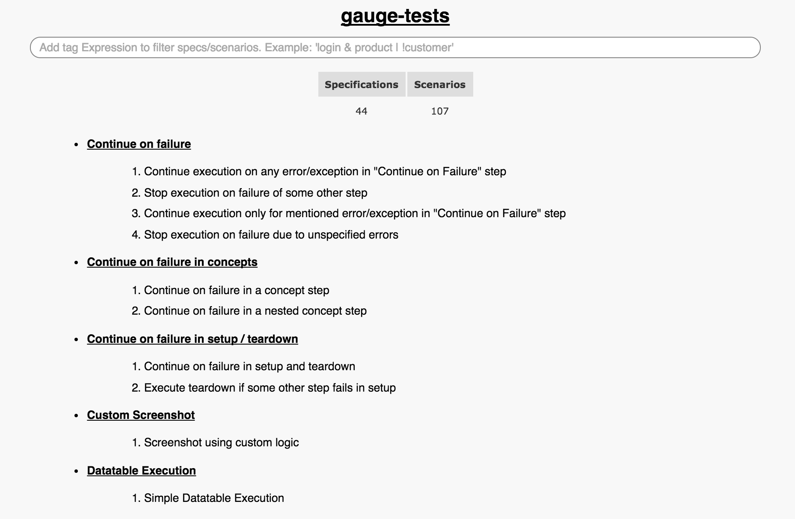

Reports
=======

HTML Reports
------------

Reports are generated using ``html-report`` plugin. By default
html-report is added to the project.

When the specs are executed, the html report is generated in ``reports``
directory in the project by default.

Configuration
^^^^^^^^^^^^^

The HTML report plugin can be configured by the properties set in the
``env/default.properties`` file in the project.

The configurable properties are:

*gauge\_reports\_dir*

-  Specifies the path to the directory where the execution reports will
   be generated.

-  Should be either relative to the project directory or an absolute
   path. By default it is set to ``reports`` directory in the project

*overwrite\_reports*

-  Set to ``true`` if the reports **should be overwritten** on each
   execution hence maintaining only the latest execution report.

-  If set to ``false`` then a **new report** will be generated on each
   execution in the reports directory in a nested time-stamped
   directory.

Default value is ``true``

XML Report
----------

XML Report plugin creates JUnit XML test result document that can be
read by tools such as Go, Jenkins. When the specs are executed, the xml
report is generated in reports directory in the project. The format of
XML report is based on `JUnit XML
Schema <https://windyroad.com.au/dl/Open%20Source/JUnit.xsd>`__

**Sample XML Report Document** :

::

    <testsuites>
        <testsuite id="1" tests="1" failures="0" package="specs/hello_world.spec" time="0.002" timestamp="2015-09-09T13:52:00" name="Specification Heading" errors="0" hostname="INcomputer.local">
            <properties></properties>
            <testcase classname="Specification Heading" name="First scenario" time="0.001"></testcase>
            <system-out></system-out>
            <system-err></system-err>
        </testsuite>
    </testsuites>

Installation
^^^^^^^^^^^^

To install XML Report plugin :

::

    gauge --install xml-report

To install a specific version of XML report plugin use the
``--plugin-version`` flag.

::

    gauge --install xml-report --plugin-version 0.0.2

**Offline Installation** :

If plugin should be installed from a zipfile instead of downloading from
plugin repository, use the ``--file`` or ``-f`` flag.

::

    gauge --install xml-report --file ZIP_FILE_PATH

Download the plugin zip from the `Github
Releases <https://github.com/getgauge/xml-report/releases>`__

Configuration
^^^^^^^^^^^^^

To add XML report plugin to your project, run the following command :

::

    gauge --add-plugin xml-report

The XML report plugin can be configured by the properties set in the
``env/default.properties`` file in the project.

The configurable properties are:

**gauge\_reports\_dir** \* Specifies the path to the directory where the
execution reports will be generated.

-  Should be either relative to the project directory or an absolute
   path. By default it is set to ``reports`` directory in the project

**overwrite\_reports** \* Set to ``true`` if the reports **should be
overwritten** on each execution hence maintaining only the latest
execution report.

-  If set to ``false`` then a **new report** will be generated on each
   execution in the reports directory in a nested time-stamped
   directory.

Default value is ``true``

Spectacle
---------

This is a Gauge plugin that generates static HTML from
Specification/Markdown files. Ability to filter specifications and
scenarios are available.

Installation
^^^^^^^^^^^^

To install :

::

    gauge --install spectacle

To install a specific version of spectacle plugin use the
``--plugin-version`` flag.

::

    gauge --install spectacle --plugin-version 0.0.2

**Offline Installation** :

If plugin should be installed from a zip file instead of downloading
from plugin repository, use the ``--file`` or ``-f`` flag.

::

    gauge --install spectacle --file ZIP_FILE_PATH

Download the plugin zip from the `Github
Releases <https://github.com/getgauge/spectacle/releases>`__

Export to HTML
--------------

Run the following command to export to HTML in a Gauge project

::

    gauge --docs spectacle <path to specs dir>

**Sample Spectacle Report**

   Sample spectacle report

**Filter Specification/Scenario based on Tags**

Tags allow you to filter the specs and scenarios. Add the tags to the
textbox in the report to view all the specs and scenarios which are
labeled with certain tags. Tag expressions with operators ``|``, ``&``,
``!`` are supported.

In the following image, the specs/scenarios are filtered using a tag
expression(\ ``refactoring & !api``).

.. figure:: images/filter.png
   :alt: Filter Specification/Scenario

   Filter Specification/Scenario
