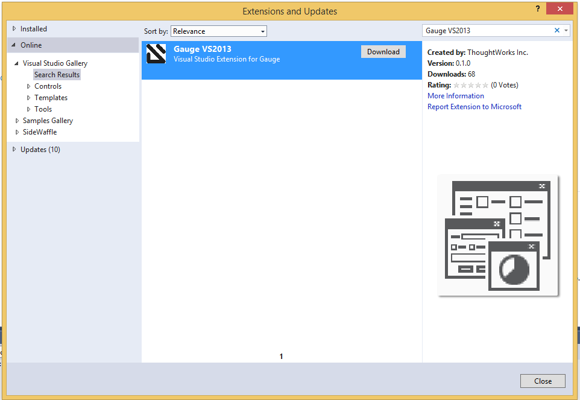

Using Gauge
===========

Gauge is a first class command line tool. This means that you can
operate entirely from the command line. Or, if you prefer to use an IDE
then Gauge also has excellent integration with multiple IDEs.

Help
----

To find all the Gauge commands and their usages, have a look at Gauge's `manpage <https://manpage.gauge.org/>`__.

``gauge`` command can be used to find the command references.

.. code-block:: console

   gauge help

The command-line interface works across platforms. On GNU/Linux and OSX,
you can use any terminal. On Windows, you can use ``cmd`` or Powershell.

Creating a project
------------------

To create or initialize a Gauge project use run

.. code-block:: console

   gauge init <template>

You can also create a project right from your the 
IDE(`Visual Studio Code <https://github.com/getgauge/gauge-vscode/blob/master/README.md#create-new-project>`__,
`Intellij <https://github.com/getgauge/Intellij-Plugin/blob/master/README.md#creating-a-java-project>`__,
 Visual Studio).

Gauge Project Templates
^^^^^^^^^^^^^^^^^^^^^^^

Gauge provides templates that can be used to bootstrap the process of
initializing a Gauge project along with a suitable build dependency
tool, webdriver etc.

To list all the Gauge project templates available, run the following
command:

.. code-block:: console

    gauge init --templates

These templates can also be found in `Bintray Gauge Templates <https://bintray.com/gauge/Templates/gauge-templates/view#files>`__.

Initialize a Gauge project with Template
~~~~~~~~~~~~~~~~~~~~~~~~~~~~~~~~~~~~~~~~

For example, to start writing a Gauge project with Java as language for
writing test code and Selenium as driver, a Gauge template 
``java_maven_selenium`` is available.These templates help getting started
to write tests easily.

To initialize a Gauge project with a template, choose a name from the
list shown on running ``gauge init --templates`` and pass that name as
an argument when initializing the Gauge project.

For example, to create a Gauge project with the ``java_maven_selenium``
template, run this command:

.. code-block:: console

    gauge init java_maven_selenium

This template creates a Gauge project with Maven as build tool and the
selenium Webdriver. This will download the Gauge template
``java_maven_selenium`` and setup your project with useful sample code.

Now, you can start writing :ref:`Specifications <spec_syntax>` and
execute them.

.. _project_structure:

Project Structure
^^^^^^^^^^^^^^^^^

On initialization of a gauge project for a particular language a project
skeleton is created with the following files

Common Gauge files
~~~~~~~~~~~~~~~~~~

.. _gauge_project_root:

``GAUGE_PROJECT_ROOT`` environment variable holds the path in which the Gauge project is created.

.. code-block:: text

    ├── env
    │  └── default
    │     └── default.properties
    ├── manifest.json
    ├── specs
       └── example.spec

Env Directory
"""""""""""""

The env directory contains multiple environment specific directories.
Each directory has `.property files <https://en.wikipedia.org/wiki/.properties>`__ which define the environment variables set during execution for that specific environment.

A **env/default** directory is created on project initialization which
contains the default environment variables set during execution.

Learn more about :ref:`managing environments <environments>`.

Specs Directory
"""""""""""""""

The specs directory contains all :ref:`spec <spec_syntax>` files for the
project. They are the business layer specifications written in simple
markdown format.

A simple example spec (**example.spec**) is created in the specs
directory to better understand the format of specifications.

Learn more about :ref:`spec <spec_syntax>`.

Manifest file
"""""""""""""

The **manifest.json** contains gauge specific configurations which
includes the information of plugins required in the project.

After project initialization, the ``manifest.json`` will have the
following content.

.. code:: js

   {
     "Language": "<language>",
     "Plugins": [
       "html-report"
     ]
   }

-  **language** : Programming language used for the test code. Gauge uses the 
corresponding language runner for executing the specs.

-  **Plugins** : The gauge plugins used for the project. Some plugins are used by default 
on each gauge project. The plugins can be added to project by running the following command :

  .. code:: console

      gauge install <plugin-name>

  Example :

  .. code:: console

      gauge install xml-report

After running the above command, the manifest.json would have the
following content:

.. code:: js

   {
     "Language": "<language>",
     "Plugins": [
       "html-report",
       "xml-report"
     ]
   }

Project files
~~~~~~~~~~~~~

Creating a new project adds some language specific files.

.. container:: code-snippet

    .. tabs::

        .. tab:: C#

            .. code-block:: text

                ├── foo.csproj
                ├── foo.sln
                ├── manifest.json
                ├── packages.config
                ├── StepImplementation.cs
                │
                ├── env
                │   └───default
                │           default.properties
                │
                ├───packages
                    └───<Nuget Package Binaries>
                ├───Properties
                │       AssemblyInfo.cs
                │
                └───specs
                        hello_world.spec

            **packages.config**

            For ``nuget``. Contains the dependencies for Gauge. One can add more to
            this list, depending on project needs.

            **StepImplementation.cs**

            Contains the implementations for the sample steps defined in
            ``hello_world.spec``.

        .. tab:: Java

            .. code-block:: text

                ├── manifest.json
                ├── libs
                └── src
                    └── test
                        └── java
                            └── StepImplementation.java
                ├── env
                    └── default
                        └── java.properties
                └───specs
                    example.spec

            **libs**

            This contains the additional java dependencies required for the project.

            **src**

            Src directory contains the classes the test code including step
            implementations.

            **java.properties**

            This defines configurations for java runner plugin.
            See :doc:`configuration` for more details.

        .. tab:: JavaScript

            .. code-block:: text

                ├── manifest.json
                └── tests
                        └── step_implementation.js
                ├── env
                    └── default
                        └── js.properties
                └───specs
                        example.spec

            **tests**

            tests directory contains the test code including step implementations.

            **js.properties**

            This defines configurations for Javascript runner plugin.
            See :doc:`configuration` for more details.

        .. tab:: Python

            .. code-block:: text

                ├── manifest.json
                └── step_impl
                        └── step_impl.py
                ├── env
                    └── default
                        └── python.properties
                └───specs
                    example.spec

            **step_impl**

            step_impl directory contains the test code including step implementations.

            **python.properties**

            This defines configurations for Python runner plugin.
            See :doc:`configuration` for more details.

        .. tab:: Ruby

            .. code-block:: text

                ├── manifest.json
                ├── env
                │   └── default
                │       └── ruby.properties
                └── step_implementations
                    └── step_implementation.rb
                └───specs
                        example.spec

            **step_implementations directory**

            This contains all the ``.rb`` files with the test code including step implementations in ruby

            **ruby.properties**

            This defines configurations for ruby runner plugin.
            See :doc:`configuration` for more details.

.. _executing_tests:

Executing tests
---------------

Inside a Gauge project, you can execute your tests by invoking 
``gauge`` with path to :ref:`specifications <spec_syntax>`. 
By convention, specifications are stored in the the ``./specs/`` 
sub-directory in the project root.

The syntax is:

.. code-block:: console

    gauge run [flags] <path-to-specs>

The ``gauge`` command-line utility allows multiple ways to specify the
specifications to be executed. A valid path for executing tests can be
path to directories that contain specifications or path to specification
files or path to scenarios or a mix of any of these three methods.

To execute all the tests in a given folder ``specs``, use

.. code-block:: console

    gauge run specs/

This will give a colored console output with details of the execution as
well an execution summary.

The path of specifications can also be specified through an environment variable <path>.
This changes the default specification directory from ``specs`` to the value defined in the environment variable. 

Gauge specifications can also be run from within the IDE
(`Visual Studio Code <https://github.com/getgauge/gauge-vscode/blob/master/README.md#run-specifications-and-scenarios>`__,
`IntelliJ IDEA <https://github.com/getgauge/Intellij-Plugin/blob/master/README.md#execution>`__,
 Visual Studio)

Specify scenarios
^^^^^^^^^^^^^^^^^

A single scenario of a specification can be executed by specifying the
line number in the span of that scenario in the spec. To execute a
``Admin Login`` scenario in the following spec use
``gauge run specs/login_test.spec:4`` command.

.. code-block:: gauge
    :linenos:
    :name: specify_scenario
    :emphasize-lines: 3-5

    # Configuration    

    ## Admin Login
    * User must login as "admin"
    * Navigate to the configuration page

This executes only the scenario present at line number ``3`` i.e
``Admin Login`` in ``login_test.spec``. In the above spec, specifying
line numbers 3-5 will execute the same scenario because of the span.

Multiple scenarios can be executed selectively as follows :

.. code-block:: console

    gauge run specs/helloworld.spec:3 specs/anotherhelloworld.spec:5

These scenarios can also belong to different specifications.

You can also specify a specific :ref:`scenario <scenario_syntax>` or a 
list of scenarios to execute. To execute scenarios, ``gauge`` takes 
path to a specification file, followed by a colon and the line number 
of the scenario. You may specify any line number which the scenario 
spans across. For example, in the above spec file, both the below 
commands will run the same scenario.

.. code-block:: console

    gauge run specs/helloworld.spec:3 # Runs scenario 'Admin Login'
    gauge run specs/helloworld.spec:5 # Runs scenario 'Admin Login'

Consider a specification file, ``spec1.spec`` defined as such,

.. code-block:: gauge
    :linenos:
    :name: specify_scenario
    :emphasize-lines: 3-5

    # Configuration    

    ## Admin Login
    * User must login as "admin"
    * Navigate to the configuration page

    ## User Login
    * User must login as "user1"
    * Navigation to configuration page is restricted.

For example, to execute the second scenario of a specification file
named ``spec1.spec``, you would do:

.. code-block:: console

    gauge run specs/spec1.spec:3

To specify multiple scenarios, add multiple such arguments. For example,
to execute the first and second scenarios of a specification file named
``spec1.spec``, you would do:

.. code-block:: console

    gauge run specs/spec1.spec:3 specs/spec1.spec:7

Specify directories
^^^^^^^^^^^^^^^^^^^

You can specify a single directory in which specifications are stored.
Gauge scans the directory and picks up valid specification files.

For example,

.. code-block:: console

    gauge run specs/

You can also specify multiple directories in which specifications are
stored. Gauge scans all the directories for valid specification files
and executes them in one run.

For example,

.. code-block:: console

    gauge run specs-dir1/ specs-dir2/ specs-dir3/

Specify files
^^^^^^^^^^^^^

You can specify path to a specification files. In that case, Gauge
executes only the specification files provided.

For example, to execute a single specification file:

.. code-block:: console

    gauge run specs/spec1.spec

Or, to execute multiple specification files:

.. code-block:: console

    gauge run specs/spec1.spec specs/spec2.spec specs/spec3.spec

Verbose reporting
^^^^^^^^^^^^^^^^^

By default, ``gauge`` reports at the specification level when executing
tests. You can enable verbose, step-level reporting by using the
``--verbose`` flag. For example,

.. code-block:: console

    gauge run --verbose specs/

.. _table_driven_execution:

Data driven execution
^^^^^^^^^^^^^^^^^^^^^
-  A *data table* is defined in markdown table format in the beginning
   of the spec before any steps.
-  The data table should have a header row and one or more data rows
-  The header names from the table can be used in the steps within
   angular brackets ``< >`` to refer a particular column from the data
   table as a parameter.
-  On execution each scenario will be executed for every data row from
   the table.
-  Table can be easily created in IDE using template
   ``table:<no of columns>``, and hit ``Tab``.
-  Table parameters are written in Multi-markdown table formats.

For example,

.. code-block:: gauge
    :linenos:
    :name: data_driven

    # Table driven execution

         |id| name    |
         |--|---------|
         |1 |vishnu   |
         |2 |prateek  |
         |3 |navaneeth|

    ## Scenario
    * Say "hello" to <name>

    ## Second Scenario
    * Say "namaste" to <name>

In the above example the step uses the ``name`` column from the data
table as a dynamic parameter.

Both ``Scenario`` and ``Second Scenario`` are executed first for the
first row values ``1, vishnu`` and then consecutively for the second and
third row values from the table.

External CSV for data table
~~~~~~~~~~~~~~~~~~~~~~~~~~~~

Data Tables for a specification can also be passed from an external CSV file. 
The parameter contains a prefix table and the path to the csv file.

**Prefix** : The prefix is table

**Value** : The value is the path to the csv file. This can be absolute file path or relative to project.

For example,

.. code-block:: gauge
    :linenos:
    :name: data_driven

    # Table driven execution

    table: /system/users.csv

    ## Scenario
    * Say "hello" to <name>

    ## Second Scenario
    * Say "namaste" to <name>

In the above example the step uses the ``name`` column from the csv file.

Execute selected data table rows
~~~~~~~~~~~~~~~~~~~~~~~~~~~~~~~~

By default, scenarios in a spec are run against all the data table rows.
It can be run against selected data table rows with flag
``--table-rows`` and specifying the row numbers against which the
scenarios should be executed. If there are multiple row numbers, they
should be separated by commas.

For example,

.. code-block:: console

    gauge run --table-rows "1" specs/hello.spec
    gauge run --table-rows "1,4,7" specs/hello.spec

Range of table rows can also be specified, against which the scenarios
are run.

For example,

.. code-block:: console

    gauge run --table-rows "1-3" specs/hello.spec

This executes the scenarios against table rows 1, 2, 3.

.. _tagged_execution:

Tagged Execution
^^^^^^^^^^^^^^^^

Tags allow you to filter the specs and scenarios quickly for execution.
To execute all the specs and scenarios which are labelled with certain
tags, use the following command.

.. code-block:: console

    gauge run --tags tag1,tag2 specs

or,

.. code-block:: console

    gauge run --tags "tag1, tag2" specs

This executes only the scenarios and specifications which are tagged
with ``tag1`` and ``tag2``.

Example:

.. code-block:: gauge
    :linenos:
    :name: tagged_execution

    # Search Specification

    The admin user must be able to search for available products on the search page.

    Tags: search,  admin

    * User must be logged in as "admin"
    * Open the product search page

    ## Successful search

    Tags: successful

    For an existing product name, the search result will contain the product name.

    * Search for product "Die Hard"
    * "Die Hard" should show up in the search results

    ## Unsuccessful search

    On an unknown product name search, the search results will be empty

    * Search for product "unknown"
    * The search results will be empty

In the above spec, if all the scenarios tagged with "search" and "successful"
should be executed, then use the following command:

.. code-block:: console

    gauge run --tags "search & successful" SPEC_FILE_NAME # Runs scenario 'Successful search' only

Execution hooks can also be filtered based on tags. 
See :ref:`filtering hooks with tags <_filtering_hooks_with_tags>` for more information.

Tag expressions
~~~~~~~~~~~~~~~

Tags can be selected using expressions. Examples:

================================== ===============================================================
Tags                               Selects specs/scenarios that
================================== ===============================================================
``!TagA``                          do not have ``TagA``
``TagA & TagB``                    have both ``TagA`` and ``TagB``.
``TagA & !TagB``                   have ``TagA`` and not ``TagB``.
``TagA | TagB``                    have either ``TagA`` or ``TagB``.
``(TagA & TagB) | TagC``           have either ``TagC`` or both ``TagA`` and ``TagB``
``!(TagA & TagB) | TagC``          have either ``TagC`` or do not have both TagA and TagB
``(TagA | TagB) & TagC``           have either [``TagA`` and ``TagC``] or [``TagB`` and ``TagC``]
================================== ===============================================================

.. _parallel_execution:

Parallel Execution
^^^^^^^^^^^^^^^^^^

Specs can be executed in parallel to run the tests faster and distribute
the load.

This can be done by the command:

.. code-block:: console

    gauge run --parallel specs

or,

.. code-block:: console

    gauge run -p specs

This creates a number of execution streams depending on the number of
cores of the machine and distribute the load among workers.

The number of parallel execution streams can be specified by ``-n``
flag.

Example:

.. code-block:: console

    gauge run --parallel -n=4 specs

This creates four parallel execution streams.

.. note:: The number of streams should be specified depending on number of CPU 
cores available on the machine, beyond which it could lead to undesirable results. 
For optimizations, try `parallel execution using threads`_.

.. _parallel execution using threads:

Parallel Execution using threads
~~~~~~~~~~~~~~~~~~~~~~~~~~~~~~~~

In parallel execution, every stream starts a new worker process. This can be optimized 
by using multithreading instead of processes. This uses only one worker process and 
starts multiple threads for parallel execution.

To use this, Set `enable_multithreading` env var to true. 
This property can also be added to the default/custom env.

.. code-block:: text

    enable_multithreading = true

**Requirements:**

* Thread safe test code.
* Language runner should support multithreading.

.. note:: Currently, this feature is only supported by Java language runner/plugin.

Executing a group of specification
~~~~~~~~~~~~~~~~~~~~~~~~~~~~~~~~~~

Specifications can be distributed into groups and ``--group`` \| ``-g``
flag provides the ability to execute a specific group.

This can be done by the command:

.. code-block:: console

    gauge run -n=4 -g=2 specs

This creates 4 groups (provided by -n flag) of specification and selects
the 2nd group (provided by -g flag) for execution.

Specifications are sorted by alphabetical order and then distributed
into groups, which guarantees that every group will have the same set of
specifications, no matter how many times it is being executed.

Example:

.. code-block:: console

    gauge run -n=4 -g=2 specs

.. code-block:: console

    gauge run -n=4 -g=2 specs

The above two commands will execute the same group of specifications.

Rerun one execution stream
""""""""""""""""""""""""""

Specifications can be distributed into groups and ``--group`` \| ``-g``
flag provides the ability to execute a specific group.

This can be done by the command:

.. code-block:: console

    gauge run -n=4 -g=2 specs

This creates 4 groups (provided by ``-n`` flag) of specification and
selects the 2nd group (provided by ``-g`` flag) for execution.

Specifications are sorted by alphabetical order and then distributed
into groups, which guarantees that every group will have the same set of
specifications, no matter how many times it is being executed.

Example:

.. code-block:: console

    gauge run -n=4 -g=2 specs

The above two commands will execute the same group of specifications.

Run your test suite with lazy assignment of tests
~~~~~~~~~~~~~~~~~~~~~~~~~~~~~~~~~~~~~~~~~~~~~~~~~

This features allows you to dynamically allocate your specs to streams
during execution instead of at the start of execution.

This allows Gauge to optimise the resources on your agent/execution
environment. This is useful because some specs may take much longer than
other, either because of the number of scenarios in them or the nature
of the feature under test

The following command will assign tests lazily across the specified
number of streams:

.. code-block:: console

    gauge run -n=4 --strategy="lazy" specs

or,

.. code-block:: console

    gauge run -n=4 specs

Say you have 100 tests, which you have chosen to run across 4
streams/cores; lazy assignment will dynamically, during execution,
assign the next spec in line to the stream that has completed it's
previous execution and is waiting for more work.

Lazy assignment of tests is the default behaviour.

Another strategy called ``eager`` can also be useful depending on need.
In this case, the 100 tests are distributed before execution, thus
making them an equal number based distribution.

.. code-block:: console

    gauge run -n=4 --strategy="eager" specs

.. note:: The 'lazy' assignment strategy only works when you do NOT use
the -g flag. This is because grouping is dependent on allocation of
tests before the start of execution. Using this in conjunction with a
lazy strategy will have no impact on your test suite execution.

Re-run failed tests
^^^^^^^^^^^^^^^^^^^

Gauge provides you the ability to re-run only the scenarios which failed
in previous execution. Failed scenarios can be run using the
``--failed`` flag of Gauge.

Say you run ``gauge run specs`` and 3 scenarios failed, you can run re-run
only failed scenarios instead of executing all scenarios by following
command.

.. code-block:: console

    gauge run --failed

This command will even set the flags which you had provided in your
previous run. For example, if you had executed command as

.. code-block:: console

    gauge run --env="chrome" --verbose specs

and 3 scenarios failed in this run, the ``gauge run --failed`` command sets
the ``--env`` and ``--verbose`` flags to corresponding values and
executes only the 3 failed scenarios. In this case ``gauge run --failed`` is
equivalent to command

.. code-block:: console

    gauge run --env="chrome" --verbose specs <path_to_failed_scenarios>

Errors during execution
^^^^^^^^^^^^^^^^^^^^^^^

Parse errors
~~~~~~~~~~~~

This occurs if the spec or concept file doesn't follow the 
expected :ref:`specifications <spec_syntax>` or :ref:`concepts <concept_syntax>` syntax.

**Example:**

.. code-block:: text

    [ParseError] hello_world.spec : line no: 25, Dynamic parameter <product> could not be resolved

List of various Parse errors:

+-------------------------------------------+--------------------------------+
| Parse Error                               | Gauge Execution Behaviour      |
+===========================================+================================+
| Step is not defined inside a concept      | Stops                          |
| heading                                   |                                |
+-------------------------------------------+--------------------------------+
| Circular reference found in concept       | Stops                          |
+-------------------------------------------+--------------------------------+
| Concept heading can only have dynamic     | Stops                          |
| parameters                                |                                |
+-------------------------------------------+--------------------------------+
| Concept should have at least one step     | Stops                          |
+-------------------------------------------+--------------------------------+
| Duplicate concept definition found        | Stops                          |
+-------------------------------------------+--------------------------------+
| Scenario heading is not allowed in        | Stops                          |
| concept file                              |                                |
+-------------------------------------------+--------------------------------+
| Table doesn’t belong to any step          | Ignores table,Continue         |
+-------------------------------------------+--------------------------------+
| Table header cannot have repeated column  | Marks that spec as             |
| values                                    | failed,Continues for others    |
+-------------------------------------------+--------------------------------+
| Teardown should have at least three       | Marks that spec as             |
| underscore characters                     | failed,Continues for other     |
+-------------------------------------------+--------------------------------+
| Scenario heading should have at least one | Marks that spec as             |
| character                                 | failed,Continues for other     |
+-------------------------------------------+--------------------------------+
| Table header should be not blank          | Marks that spec as             |
|                                           | failed,Continues for other     |
+-------------------------------------------+--------------------------------+
| Multiple spec headings found in the same  | Marks that spec as             |
| file                                      | failed,Continues for other     |
+-------------------------------------------+--------------------------------+
| Scenario should be defined after the spec | Marks that spec as             |
| heading                                   | failed,Continues for other     |
+-------------------------------------------+--------------------------------+
| Could not resolve table from file         | Marks that spec as             |
|                                           | failed,Continues for other     |
+-------------------------------------------+--------------------------------+
| Spec does not have any element            | Marks that spec as             |
|                                           | failed,Continues for other     |
+-------------------------------------------+--------------------------------+
| Spec heading not found                    | Marks that spec as             |
|                                           | failed,Continues for other     |
+-------------------------------------------+--------------------------------+
| Spec heading should have at least one     | Marks that spec as             |
| character                                 | failed,Continues for other     |
+-------------------------------------------+--------------------------------+
| Dynamic param could not be resolved       | Marks that spec as             |
|                                           | failed,Continues for other     |
+-------------------------------------------+--------------------------------+
| Step should not be blank                  | Marks that spec as             |
|                                           | failed,Continues for other     |
+-------------------------------------------+--------------------------------+
| Duplicate scenario definition found in    | Marks that spec as             |
| the same specification                    | failed,Continues for other     |
+-------------------------------------------+--------------------------------+

Validation Errors
~~~~~~~~~~~~~~~~~

These are errors for which `Gauge` skips executing the spec where the error occurs.

There are two types of validation error which can occurs

    1. Step implementation not found
        If the spec file has a step that does not have an implementation in the projects programming language.
    2. Duplicate step implementation
        If the spec file has a step that is implemented multiple times in the projects.

**Example**

.. code-block:: text

    [ValidationError] login.spec:33: Step implementation not found. login with "user" and "p@ssword"

.. code-block:: text

    [ValidationError] foo.spec:11 Duplicate step implementation => 'Vowels in English language are <table>'

Refactoring
-----------

Rephrase steps
^^^^^^^^^^^^^^

Gauge allows you to rephrase a step across the project. To rephrase a
step run:

.. code-block:: console

    gauge refactor "old step <name>" "new step name"

Here ``<`` and ``>`` are used to denote parameters in the step.
**Parameters can be added, removed or changed while rephrasing.**

This will change all spec files and code files (for language plugins
that support refactoring).

For example,

Let's say we have the following steps in our ``spec`` file:

.. code-block:: gauge

    * create user "john" with id "123"
    * create user "mark" with id "345"

Now, if we now need to add an additional parameter, say ``last name``,
to this step we can run the command:

.. code-block:: console

    gauge refactor "create user <name> with id <id>" "create user <name> with <id> and last name <watson>"

This will change all spec files to reflect the change.

.. code-block:: gauge

    * create user "john" with id "123" and last name "watson"
    * create user "mark" with id "345" and last name "watson"

.. _`ide_support`:

IDE Support
-----------

The listed IDE plugins are available for gauge to make writing specs and
test code simpler.

- Integration with :ref:`Visual Studio Code <vs_code>`
- Integration with :ref:`IntelliJ IDEA <intellij_idea>`
- Integration with :ref:`Visual Studio <visual_studio>`

.. _`vs_code`:

Visual Studio Code
^^^^^^^^^^^^^^^^^^

Gauge projects can be created and executed in Visual Studio Code using the
`Gauge extension for VSCode <https://marketplace.visualstudio.com/items?itemName=getgauge.gauge>`__.
This plugin currently supports Gauge with JavaScript, Ruby and Python.

More information on IDE features and how to use it can be found `here <https://github.com/getgauge/gauge-vscode/blob/master/README.md>`__.

.. _`intellij_idea`:

IntelliJ IDEA
^^^^^^^^^^^^^

Gauge projects can be created and executed in IntelliJ IDEA using the
`Gauge plugin for IntelliJ IDEA <https://plugins.jetbrains.com/plugin/7535-gauge>`__.
This plugin only supports Gauge with Java.

More information on IDE features and how to use it can be found `here <https://github.com/getgauge/Intellij-Plugin/blob/master/README.md>`__.

.. _`visual_studio`:

Visual Studio
^^^^^^^^^^^^^

Gauge projects can be created and executed in Visual Studio using the
Visual Studio plugin for Gauge. This plugin can be installed from Visual
Studio Gallery.

Installation
~~~~~~~~~~~~

-  Open Visual Studio Extension Manager from ``Tools`` ->
   ``Extensions and Updates``.
-  Go to ``Visual Studio Gallery`` and search for ``Gauge VS2013``.
-  Click on ``Download`` and select ``Install`` option.
-  Restart Visual Studio in order for the changes to take effect.

The extension resides on the `Visual Studio
Gallery <https://marketplace.visualstudio.com/items?itemName=vs-publisher-1071478.GaugepluginforVisualStudio>`__.

   install plugin

Creating a new Gauge Project
~~~~~~~~~~~~~~~~~~~~~~~~~~~~

Install project and item templates from Visual Studio Marketplace
"""""""""""""""""""""""""""""""""""""""""""""""""""""""""""""""""
-  Download the templates from `Visual Studio MarketPlace <https://marketplace.visualstudio.com/items?itemName=vs-publisher-1071478.gauge-visualstudio-templates>`__.
-  Install the Gauge VisualStudio Templates - vsix

Create Gauge Project
""""""""""""""""""""
-  Go to ``File`` -> ``New Project``.
-  Choose ``Gauge Test Project`` under Visual C# Test category.

.. figure:: images/visual_studio_screenshots/features/Create_Project.png
   :alt: Create New Project

   ProjectCreation

-  Choose the Project location and Project Name.
-  Click ``OK``.

This should setup a new Gauge project, and add the required meta data
for Gauge to execute this project.

Alternately, you can create a Gauge project from command-line as:

.. code-block:: console

    mkdir <project_name>
    cd <project_name>
    gauge init csharp

This creates ``<project_name>.sln`` file which can be opened with Visual
Studio.

Syntax Highlighting
~~~~~~~~~~~~~~~~~~~

Gauge specs are in `Markdown <https://daringfireball.net/projects/markdown/syntax>`__
syntax. This plugin highlights Specifications, Scenarios, Steps and
Tags.

Steps with missing implementation are also highlighted.

.. figure:: images/visual_studio_screenshots/features/Syntax_highlighting.png
   :alt: syntax highlighting

   syntax highlighting

Auto Completion
~~~~~~~~~~~~~~~

This plugin hooks into VisualStudio Intellisense, and brings in
autocompletion of Step text. The step texts brought in is a union of
steps already defined, concepts defined, and step text from
implementation.

*Hint:* Hit Ctrl + Space to bring up the Intellisense menu.

.. figure:: images/visual_studio_screenshots/features/AutoComplete.png
   :alt: Auto Complete

   AutoComplete

Implement Step
~~~~~~~~~~~~~~~
If you have an unimplemented step in the spec file, it will be get highlighted with a red underline.
Hover over towards the end of step text to get the Smart Tag to implement it.
On clicking the Smart Tag a pop up opens. The destination of the implementation can be chosen, either
a new class or from a list of existing classes. It will then generate
the step with required annotation and parameters.

.. figure:: images/visual_studio_screenshots/features/quickfix/QuickFix.gif
   :alt: step quick fix

   step quick fix

Navigation
~~~~~~~~~~

Jump from Step text to it's implementation.

Usage: ``Right Click`` -> ``Go to Declaration`` or hit F12

Formatting
~~~~~~~~~~

-  A specification file can be formatted easily using ``Right Click`` -> ``Format File``

This formats the specification including indentation of tables and
steps.

Execution with Test Explorer
~~~~~~~~~~~~~~~~~~~~~~~~~~~~

.. note::
    Refer `MSDN Documentation on Unit Test Explorer <https://msdn.microsoft.com/en-us/library/hh270865.aspx#Anchor_2>`__ for
    all features of Unit Test Explorer.

When you build the test project, all the test scenarios appear in Test Explorer.
If Test Explorer is not visible, choose Test on the Visual Studio menu, choose Windows, and then choose Test Explorer.

.. figure:: images/visual_studio_screenshots/features/TestExplorer.png
   :alt: Test Explorer

   Test Explorer

Run tests
"""""""""

* To run all the scenarios in a solution, choose Run All.
* To run all the scenarios of a specification, choose Run... and then choose the group on the menu.
* To run one or more scenarios, select the individual scenarios that you want to run, open the context menu for a selected scenario and then choose Run Selected Tests.

Run tests in parallel
"""""""""""""""""""""

If individual scenarios have no dependencies that prevent them from being run in any order,
turn on parallel test execution with the |ute_parallel| toggle button on the toolbar.

If you want to use the parallel run of Gauge refer the :ref:`command line parallel execution <parallel_execution>`.

Test results
""""""""""""

The pass/fail bar at the top of the Test Explorer window is animated as the scenarios run.
At the conclusion of the run, the pass/fail bar turns green if all tests passed or turns red if any test failed.

As you run, write, and rerun your tests, Test Explorer displays the results in default groups of Failed Tests,
Passed Tests, Skipped Tests and Not Run Tests. You can change the way Test Explorer groups your tests.
You can perform much of the work of finding, organizing and running tests from the Test Explorer toolbar.

.. figure:: images/visual_studio_screenshots/features/TestExplorerOptions.png
  :alt: Test Explorer Options

  Test Explorer options

Traits
""""""
Groups of scenarios by specification, tags that are defined.

Search and filter the test list
"""""""""""""""""""""""""""""""
This Test Explorer feature can be used as mentioned in `Search and filter the test list <https://msdn.microsoft.com/en-us/library/hh270865.aspx#BKMK_Search_and_filter_the_test_list>`__ of Visual Studio documentation.

Debugging
~~~~~~~~~

Debugging can be performed the same way spec execution works.

``Right click`` -> ``Debug Selected Tests`` on a scenario(s) in the Test explorer. Execution
will halt on marked `breakpoints <https://msdn.microsoft.com/en-us/library/5557y8b4.aspx>`__.

Rephrase Steps
~~~~~~~~~~~~~~

-  ``right click`` -> ``Rename`` on a step to rephrase it.
-  The parameters can also be reordered,removed or new parameters can be
   added.
-  The rephrase change will reflect across **all the specs** in the
   project.

Find Usages
~~~~~~~~~~~

-  Right click on a step -> Find All References

Create Spec and Concept files
~~~~~~~~~~~~~~~~~~~~~~~~~~~~~

-  You can right-click on ``specs`` directory or any nested directory,
   choose ``Add`` -> ``New Item`` -> Go to ``Gauge`` under
   ``Visual C# Items``.
-  Choose ``Specification`` or ``Concept`` file type.
-  Enter file name and click ``Add``.

.. figure:: images/visual_studio_screenshots/features/Create_FileType.png
   :alt: Create FileType

   Create File Type

.. |ute_parallel| image:: images/visual_studio_screenshots/UTE_parallelicon-small.png
